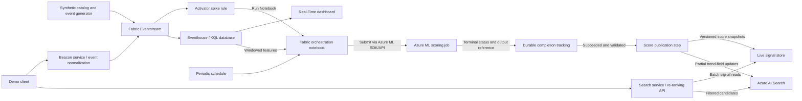

# Dynamic real-time search POC

A proof of concept for making **Azure AI Search** product rankings respond
to recent shopper activity and simulated external trends, using **Microsoft
Fabric Real-Time Intelligence** and **Azure Machine Learning** for
reproducible score-generation jobs.


## What this POC will demonstrate

For the same search, such as "blue jacket", compare results before, during,
and after a synthetic spike:

1. **Baseline:** Azure AI Search relevance without trend boosting.
2. **Index-side:** relevance plus a scoring profile using periodically
   updated trend fields.
3. **Hybrid:** index-side results plus a bounded application-side adjustment
   using fresher live signals.

The objective is to show an observable change in relevant product ordering
within **1-5 minutes** for the initial index-side experiment. The selected
notebook-to-Azure-ML path is asynchronous batch/near-real-time processing;
its end-to-end latency must be measured separately. A seconds-level
inference path is an optional later experiment, not a notebook/job promise.
These are targets to measure, not platform guarantees.

### Scope

- A reproducible synthetic catalog of 50-200 products.
- Behavioral events: `search`, `view_product`, `add_to_bag`,
  `remove_from_bag`, and `purchase`.
- Simulated product-level virality and compound attribute trends, such as
  `colour=blue AND category=jackets`.
- Ingestion, windowed aggregation, score delivery, search comparison, and
  an explanation of why results moved.
- Activator-triggered Fabric notebooks that submit Azure ML scoring jobs,
  with completion tracking and publication of validated score outputs.
- Decay, expiry, retries, and degraded-mode behavior sufficient to make the
  demonstration trustworthy.

Production personalization, real social-media scraping, a full recommendation
engine, and replacing Azure AI Search relevance are out of scope. Azure ML
initially runs the deterministic scoring baseline; a learned trend model
can follow only with defined training data and evaluation criteria. Start
with keyword search; vector and semantic search are optional extensions.
No generative model or agent is required for the core POC.

## Service API contracts

The storefront-facing interface is split into two independent draft
OpenAPI contracts:

| Service | Endpoint | Contract |
|---|---|---|
| Search | `POST /v1/search` - retrieve and rank products | [Search API](docs/api/search.openapi.json) |
| Beacon | `POST /v2/events` - capture search, view, cart, and order activity | [Beacon API](docs/api/beacon.openapi.json) |

See the [contract review and integration notes](docs/api/README.md) for
source limitations, proposed responses, authentication decisions, and the
mapping from public beacon payloads to internal Fabric events. The supplied
source is an incomplete Postman export, not an OpenAPI definition; these
drafts do not imply that either service is implemented or provider-compatible.

## Architecture

Retain **Option C's hybrid serving design** from the research, implemented
incrementally: first prove index-side boosting, then add Azure ML score
generation and live-store re-ranking. This revision replaces the
Power Automate action with Activator's native **Run Notebook** action.
It is not the original seconds-level fast path.



Activator's rule input must contain the fields needed by the rule. A
behavioral-window rule requires an explicitly wired aggregate feed; landing
raw events in Eventhouse alone does not implement this connection. Start
event-triggered runs with explicit synthetic `external_trend` events and
verify that the required feature window is available before submitting a
job. Periodic runs handle steady traffic, decay, and clearing expired
boosts even when no spike occurs.

| Component | Responsibility |
|---|---|
| Generator | Seeded catalog, baseline traffic, product spikes, attribute spikes, and replayable event IDs |
| Beacon service | Capture storefront events, deduplicate and normalize the public payload into the internal event envelope |
| Eventstream | Ingest and route validated event envelopes to Eventhouse and Activator |
| Eventhouse | Raw event history, deduplication, catalog lookup, rolling features, and the initial deterministic score baseline |
| Activator | Detect qualifying conditions and trigger a Fabric notebook, subject to run deduplication and cooldown |
| Fabric notebook | Select a bounded feature snapshot, submit an Azure ML job, and persist its correlation and job ID |
| Azure ML job | Execute versioned scoring code/model against the selected feature snapshot and produce score artifacts |
| Completion tracking | Reconcile terminal job status, report failures/timeouts, and allow only successful validated outputs to be published |
| Score publication | Update existing search documents and live snapshots with partial-failure retries and stale-write protection |
| Live signal store | Per-product score, feature-window time, calculation time, model/scoring version, and explicit expiry |
| Search service / re-ranking API | Retrieve candidates, apply bounded freshness adjustments, and return results with diagnostic metadata |
| Dashboard and telemetry | Explain score inputs and trace event-to-visible-ranking latency |

### Starting implementation choices

These are proposed defaults, not existing repository conventions:

- **Azure Functions** for the Search/re-ranking and Beacon APIs. No Function
  or Power Automate flow is required solely to launch the Azure ML job.
- **Fabric notebook** as the orchestration entry point, triggered by
  Activator or a periodic schedule.
- **Azure ML command/pipeline jobs** for reproducible scoring and, when
  justified, model training. Develop logic in notebooks, then package
  automated execution as scripts/components with pinned environments.
- **Azure Cosmos DB for NoSQL** for the live signal store, with per-product
  partitioning and expiry. A Redis-based store or Container Apps is an
  alternative only if measurements justify the switch.
- **Bicep** for supported Azure resources. Use supported Fabric APIs or
  documented manual steps/exports for workspace items; do not assume every
  Fabric item is an ARM/Bicep resource.
- **KQL** for aggregation. The index-side MVP can publish its deterministic
  baseline directly; the Azure ML milestone runs that same baseline as a
  job before introducing a learned model.
- Select and document a supported application language/runtime, dependency
  versions, and actual build/test commands when scaffolding Phase 0. No
  application framework has been selected yet.

### Notebook triggering and job lifecycle

Activator's **Run Notebook** action targets a **Fabric notebook**, not an
interactive Azure ML notebook. The Fabric notebook submits an Azure ML
command or pipeline job through the SDK/API. A successful submission means
the job was accepted, not that scoring or publication has completed.

1. Coalesce triggers by customer/collection, feature window, and scoring
   version. Apply cooldown and concurrency limits; do not start a notebook
   or ML job for every shopper event.
2. Prepare an immutable feature snapshot accessible to the job identity.
   Record its location, window watermark, and schema version. Do not assume
   Azure ML can automatically access Eventhouse or OneLake.
3. Persist the submission key and Azure ML job ID. Reconcile uncertain
   submissions before retrying so duplicate alerts do not create duplicate
   work.
4. Use a durable run ledger and scheduled reconciliation to track success,
   failure, cancellation, and timeout, rather than relying on a notebook
   session remaining alive. Surface failures and retain the last valid
   scores only until their defined expiry.
5. Validate successful artifacts against product keys, score bounds,
   freshness, and scoring/model version before publishing. Track Search
   per-document results and live-store writes independently; retry partial
   publication without recomputing the job. An older feature window must
   not win merely because its job completed later.

Scheduled and event-triggered runs share this lifecycle. Use one active
scoring policy for both index and live snapshots; do not blend unrelated
model versions as though their scores were directly comparable.

### Optional seconds-level inference

Notebook startup, compute provisioning, and ML job queues are not suitable
for a reliable seconds-level response. If that requirement remains after
measurement, deploy a trained model to an **Azure ML online endpoint** and
invoke it from a separately designed stream-processing signal writer.
This is optional, not a second path implemented by the notebook diagram.
It requires its own feature-state, identity, throughput, latency, and cost
validation. Keep job-based training separate from online inference.

## Data and ranking contract

The research [event schema](docs/06-event-schema.md) is the starting
contract. Preserve its envelope and event names. Before implementation,
formalize validation, schema versioning, and correlation metadata; the
research's abbreviated examples are not complete production schemas.
The [Beacon contract](docs/api/beacon.openapi.json) uses the supplied
client-facing payload names; normalize them at ingestion as described in
the [mapping notes](docs/api/README.md#mapping-to-the-pocs-internal-events)
rather than changing the internal research event names.

- Use UTC event time for windows; record ingestion/calculation times
  separately. Deduplicate by `eventId`, including before expanding
  `purchase.payload.items`.
- Search events without a product ID must not be arbitrarily attributed
  to every result. Define whether counts represent events or quantities
  and how `remove_from_bag` contributes before enabling those features.
- Start with a seeded catalog lookup shared with Eventhouse for
  attribute-to-product mapping. Preserve the **whole attribute predicate**:
  blue jackets must not become all blue products plus all jackets.
- Start with the research's normalized score in `[0, 100]`, behavioral
  weights `1:2:3` for views/add-to-bag/purchases, and `alpha=0.5`.
  Specify normalization, confidence handling, time decay, and empty-window
  behavior in deterministic tests before tuning.

### Index-side path

Use a stable product key and retain catalog fields such as title,
description, category, colour, brand, price, and image reference. Add:

| Field | Search type | Purpose |
|---|---|---|
| `trendingScore` | `Edm.Double` | Normalized trend strength |
| `lastTrendingAt` | `Edm.DateTimeOffset` | Time of qualifying trend activity, not simply the last sync |
| `trendingTags` | `Collection(Edm.String)` | Optional tag-based boosts |

Configure the retrievable/filterable properties needed by the scoring
functions and API. Start with magnitude and freshness; enable tag boosting
only with a defined query-time tag source and overlap tests.

Use `merge` for score-only updates to seeded documents so unknown keys fail
explicitly rather than creating incomplete catalog records.
`mergeOrUpload`, suggested in the research, is appropriate only when
upserting complete product documents is intentional. Batch within service
limits, inspect every document result, and retry transient failures only.

Update the recently active set **and previously boosted products that now
need clearing**. Cache TTL does not clear indexed magnitude scores or tags.
Schedule explicit zero/reset updates and verify that an expired spike no
longer changes ranking.

### Hybrid serving and double-boost protection

Query-time reads are fast, but signal freshness is bounded by the Azure ML
job and publication lifecycle. The live store can expose a completed score
before Search index propagation; it does not make job execution real-time.

Fetch a bounded candidate set (initially 100-200) with the same query and
filters, batch-read signals, re-rank, and trim to the requested result count.
Only retrieved, eligible products can move; live signals cannot introduce
unrelated products or bypass filters. Begin with a single result page;
stable multi-page behavior needs a separate design.

Keep indexed and live snapshots distinguishable by calculation time/version.
Compare the live score with the indexed score **returned on that candidate**,
not merely the last successfully submitted index update: acceptance is not
proof of query visibility. Apply only a bounded incremental adjustment;
an equal live/indexed score must produce no extra boost.

The research's `liveScore - indexedScore` is a starting heuristic, not an
exact inverse of Search scoring-profile mathematics. Do not add raw
0-100 trend scores directly to BM25/vector/semantic scores. Define and test
the normalization, cap, tie-breaking, negative-delta behavior, and selected
Search score before enabling the hybrid mode. Older writes must not
overwrite fresher live state.

If the signal store fails or a signal is expired, return the index-side
ordering with an explicit degraded-mode indicator and telemetry. If Search
itself fails, return an explicit error, not an empty success response.

## Prerequisites and feasibility checks

Before provisioning or selecting SKUs:

- An Azure subscription and permission to create the selected resources
  and assign narrowly scoped roles.
- A Fabric-enabled capacity and workspace with access to Eventstream,
  Eventhouse, notebooks/pipelines, and, for Phase 3, Activator.
- An Azure ML workspace, supported job compute, storage, and a versioned
  execution environment, with sufficient regional compute quota.
- Permission for Activator to run the Fabric notebook, and a supported
  notebook identity authorized to submit and inspect Azure ML jobs.
  Power Automate licensing is not needed for this route.
- A supported local runtime, Azure CLI, and Bicep tooling once scaffolding
  choices are recorded.
- Confirm region availability, quotas, network connectivity, cost limits,
  and a teardown owner for all Azure and Fabric resources.

Prefer Microsoft Entra authentication and managed identities where the
specific integration supports them. Validate notebook/workspace identity
access to Azure ML independently; validate job access to feature/output
storage and publisher access to Search and Cosmos DB separately. Identity
support is not automatically available across every connector.
Keep unavoidable endpoint credentials in
an approved secret store, never in source, notebook outputs, or exports.
Use synthetic/anonymous shopper data only.

The research's 1-2 minute notebook cadence is a hypothesis. Measure
Activator delivery, Fabric notebook startup, ML queue/provisioning time,
job execution, completion reconciliation, publication, and index
propagation separately. Validate schedule frequency and run overlap in the
target tenant. Publish observed end-to-end results even if they exceed
1-5 minutes; do not apply the original fast-path budget to this job route.

## Build roadmap

Use the [research POC plan](docs/07-poc-plan.md) as background, with the
revised milestones below taking precedence for notebook/ML orchestration.
The research's Power Automate and immediate signal-writer route is no
longer the selected implementation.

| Phase | Deliverables | Exit gate |
|---|---|---|
| 0 - Foundations | Runtime choice, configuration template, Azure/Fabric setup, Azure ML workspace/compute/environment, catalog/index seed | Baseline queries work against 50-200 SKUs; notebook-to-ML permissions and feature/output access are verified; setup and cleanup are reproducible |
| 1 - Ingest and aggregate | Event validation, seeded generator, Eventstream routing, KQL tables/queries and score tests | A known event sequence yields expected deduplicated per-product scores, including compound attributes |
| 2 - Index-side MVP | Scoring profile, scheduled score writer, partial-failure handling, expiry/reset | A relevant SKU moves within 1-5 minutes of injection and settles after expiry; record the actual sync cadence |
| 3 - Azure ML and hybrid | Activator Run Notebook, scheduled orchestration, reproducible scoring job, durable run ledger, publication, versioned store, re-ranking API | One bounded logical run per submission key; only successful valid outputs publish; stale jobs cannot overwrite newer windows; latency is measured and equal snapshots do not double-boost |
| 4 - Evidence | Three-mode comparison scripts or small UI, dashboard, trace and latency report | Repeatable before/during/after results with measured budgets and documented limitations |

Planned implementation areas (these do not exist yet):

```text
infra\                       Azure Bicep and deployment parameters
src\load-generator\          Catalog seed and synthetic event scenarios
src\beacon-api\              Storefront event capture and normalization
src\signal-writer\           Validated job-output publication to Search/live state
src\reranking-api\           Candidate retrieval and incremental blend
src\ml\                     Azure ML scoring/training scripts and job definitions
src\fabric\eventstream\      Sanitized definitions and setup instructions
src\fabric\eventhouse\       Tables, mappings, aggregation KQL
src\fabric\notebooks\        Feature snapshots, ML submission and run reconciliation
tests\                      Contract, ranking, and integration checks
```

When each area is built, replace blueprint-only guidance with verified
install, configure, seed, run, test, demo, and teardown commands. Do not add
placeholder commands that appear runnable.

## Demonstration and acceptance

Use the same catalog seed, query, filters, result count, and recorded
configuration for all three modes. Ensure the target SKU is initially an
eligible candidate with room to move.

1. Capture baseline product IDs, ranks, scores, and UTC timestamps.
2. Inject a known burst of views/add-to-bag/purchases for one SKU.
3. Repeat with a high-confidence product trend, then with a blue-jackets
   attribute trend. Verify nonmatching products are not boosted by that
   attribute signal.
4. Poll all modes, recording the first visible rank change and signal
   versions. Trace a representative event through aggregation and delivery.
5. Stop injection and verify window decay, cache expiry, and indexed resets.
6. Replay duplicates and out-of-order events; simulate partial indexing
   failure and live-store unavailability. Confirm deterministic results,
   retries without double counting, and visible degradation.
7. Trigger the same feature window twice and overlap scheduled/event runs.
   Verify submission deduplication, cooldown, and concurrency limits.
8. Exercise failed/cancelled/timed-out jobs, notebook interruption, and
   out-of-order completion. Confirm reconciliation resumes from persisted
   state, invalid artifacts never publish, and older windows cannot
   overwrite newer scores.

| Measurement | Target or evaluation rule |
|---|---|
| Event emission to Eventhouse availability | < 5 seconds |
| Event arrival to updated rolling aggregate | < 30 seconds |
| Spike detection to notebook start | Measure action delivery and startup separately; no seconds-level guarantee |
| ML submission to completed score artifact | Measure queue, provisioning, and execution; job-based processing |
| Job completion to live-store / visible Search update | Measure reconciliation, publication, and index propagation separately |
| Initial deterministic sync cycle to visible Search update | Research target: approximately 1-2 minutes; validate schedule feasibility |
| Event injection to visible index-side rank change | Initial MVP target: 1-5 minutes; report misses |
| Event injection to visible ML/hybrid rank change | Measure the full notebook/job path; original single-digit-seconds target does not apply |
| Optional online inference path | Separate seconds-level experiment only if implemented and verified |
| Added API work for live read and re-sort | < 50 ms |

Capture repeated runs, sample counts, p50/p95 latency, failure counts, and
candidate-set limitations. Separate service targets from measured outcomes;
report missed targets rather than silently widening them. Record costs
using the correct units: Search capacity/indexing throughput, Cosmos DB
RUs, Fabric capacity usage, Azure ML compute/storage (including idle compute
or online deployments if enabled), and application request/runtime costs.

## Research and implementation references

| Research | Read for |
|---|---|
| [Problem statement](docs/01-problem-statement.md) | Personas, goals, non-goals |
| [Azure AI Search primer](docs/02-ai-search-primer.md) | Scoring profiles, partial updates, application re-ranking |
| [Fabric primer](docs/03-fabric-primer.md) | Ingestion, aggregation, automation, custom integration |
| [Architecture options](docs/04-architecture-options.md) | A/B/C trade-offs |
| [Recommended architecture](docs/05-recommended-architecture.md) | Hybrid responsibilities and latency budgets |
| [Event schema](docs/06-event-schema.md) | Event payloads, aggregates, initial score formula |
| [POC plan](docs/07-poc-plan.md) | Phases and open questions |
| [Azure ML forecasting](docs/08-azure-ml-forecasting.md) | AutoML model options, evaluation, and a staged recommendation |
| [Copilot instructions](.github/copilot-instructions.md) | Implementation guardrails for this repository |

The research is design input, not a guarantee of current platform behavior.
In particular:

- [Scoring profiles with semantic ranker](https://learn.microsoft.com/azure/search/semantic-how-to-enable-scoring-profiles)
  can apply functions after semantic ranking and return
  `@search.rerankerBoostedScore`. The research's simplified ordering is not
  universal. If semantic search is added, verify the chosen API/SDK version,
  configuration, score field, and top-50 semantic candidate limit.
- [Activator Fabric-item actions](https://learn.microsoft.com/fabric/real-time-intelligence/data-activator/activator-trigger-fabric-items)
  support **Run Notebook** directly for Fabric notebooks. Parameter passing
  is documented as preview; verify availability and types in the target
  tenant, and do not depend on undocumented trigger payload fields.
- [Azure ML job automation](https://learn.microsoft.com/training/modules/use-azure-machine-learn-job-for-automation/)
  describes converting notebook logic to scripts and command/pipeline jobs.
  [Azure ML pipeline submission](https://learn.microsoft.com/azure/machine-learning/how-to-create-component-pipeline-python)
  uses the SDK; it is a separate step from Activator launching a Fabric
  notebook. Neither action proves downstream scoring/publication success.
- Verify current [Search indexing guidance](https://learn.microsoft.com/azure/search/search-how-to-load-search-index)
  and [scoring-profile rules](https://learn.microsoft.com/azure/search/index-add-scoring-profiles)
  before implementing the bridge. Rolling time decay also needs evaluation
  as the clock advances; an ingestion-triggered update alone does not
  guarantee expired signals are recalculated.
