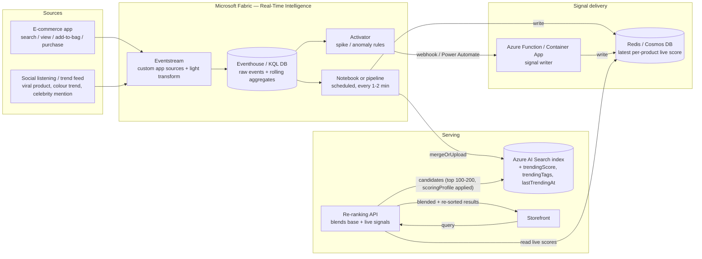

# Recommended architecture (Option C: hybrid)

## Diagram

## Component responsibilities

| Component | Responsibility | Update cadence |
|---|---|---|
| Eventstream | Ingest first-party + external events; light validation/enrichment; route to Eventhouse | Streaming (sub-second) |
| Eventhouse (KQL DB) | Store raw events; compute rolling per-product/per-attribute aggregates (`ProductSignals1Min`, `ProductSignals5Min`, `AttributeTrend5Min` for colour/category-level signals) | Streaming ingestion, queryable continuously |
| Activator | Watch aggregates/raw stream for spike conditions (e.g., 5-min view count > 3x trailing 1h baseline, or an external "viral" event with high confidence) | Sub-second to seconds |
| Notebook/pipeline | Periodically (1–2 min) compute normalized `trendingScore` per product from Eventhouse, `mergeOrUpload` into AI Search index, and write the same value into the cache | 1–2 min |
| Signal writer function | Consume Activator's spike action (or an Eventstream custom endpoint) and immediately update the cache for the affected product(s)/tags, bypassing the notebook cadence | Seconds |
| Cache (Redis/Cosmos DB) | Hold the latest live score per `productId` (and optionally per tag/colour/category for attribute-level boosts) | Always current (last writer wins, short TTL as safety net) |
| AI Search index | Base relevance (text/vector) + scoring profile boost from the *baked-in* trending fields | Reflects notebook cadence (1–2 min) |
| Re-ranking API | Query AI Search for a larger candidate set (already boosted by the baked-in scoring profile), then apply an *additional* light re-sort using the cache's fresher values for the "did something just spike in the last 30s" case, then trim/return the final page | Real-time (per-request) |

## Avoiding double-boosting

Because both the index scoring profile *and* the re-ranking API apply a
trending boost, define a single canonical `trendingScore` per product and:

- Have the re-ranking API compute its *delta* against what's already baked
  into the index (`liveScore - indexedScoreAtLastSync`), only applying the
  incremental change since the last notebook run, not the full score again.
- Alternatively, keep the index-side boost intentionally modest/capped
  (e.g., contributes at most 20% of final score) and let the app-side
  re-ranker own the "big spike" adjustments, so their combination stays
  interpretable.

This should be a concrete, tunable parameter validated during the POC, not
hardcoded.

## Attribute-level signals (colour, category, brand — not just SKU)

The "blue clothing is trending because of a celebrity" case is
*attribute*-level, not single-SKU. Model this as:

1. External trend events carry structured attributes: `{"signalType":
   "external_trend", "attributes": {"colour": "blue", "category":
   "jackets"}, "confidence": 0.82, "source": "tiktok", "sourceUrl": "..."}`
   (see [06-event-schema.md](06-event-schema.md)).
2. Eventhouse computes an `AttributeTrend5Min` aggregate table keyed by
   attribute value (e.g., `colour=blue`).
3. The notebook/signal-writer resolves *which products* are affected by
   joining the trending attribute against the product catalog (a lookup
   table or an AI Search filter query for `colour eq 'blue' and category eq
   'jackets'`) and boosts that whole matching set, rather than needing a
   1:1 product-level event for every trending item.
4. In AI Search, this can also be expressed directly as a **tag scoring
   function**: write a `trendingTags` collection field on products (e.g.
   `["blue", "celebrity-endorsed"]`) and pass matching tags as a
   `scoringParameter` at query time — giving a boost purely from the tag
   overlap without needing per-product score updates at all for this class
   of signal.

## Latency budget (target)

| Stage | Target latency |
|---|---|
| Event emitted → landed in Eventhouse | < 5 s |
| Eventhouse rolling aggregate reflects new event | < 30 s (windowed) |
| Activator detects spike → cache updated | < 10 s from detection |
| Notebook cycle → AI Search index updated | 1–2 min |
| Re-ranking API blend (cache read + sort) | < 50 ms added to request |

## Non-functional considerations

- **Cost:** the notebook/pipeline should only touch the "hot set" of
  products with recent activity (query Eventhouse for `WHERE
  windowStart > ago(10m)` products only), not the whole catalog, to keep
  `mergeOrUpload` volume proportional to actual activity.
- **Consistency:** the cache is a best-effort "latest score" store; a
  short TTL (e.g., 15–30 min) ensures a product's boost decays away if the
  pipeline stops updating it (avoids stale "stuck trending" products).
- **Observability:** tag every event with a correlation id; expose a Power
  BI/Real-Time dashboard directly on the Eventhouse tables so merchandisers
  can see *why* a product is ranked where it is (which is also useful for
  debugging the POC).
- **Safety:** cap the maximum boost multiplier so a single anomalous event
  burst can't push an irrelevant product to the top of every query; treat
  the trending signal as one input to ranking, not an override of
  relevance/filtering (e.g. category-mismatched queries should never
  surface an irrelevant "trending" product).
