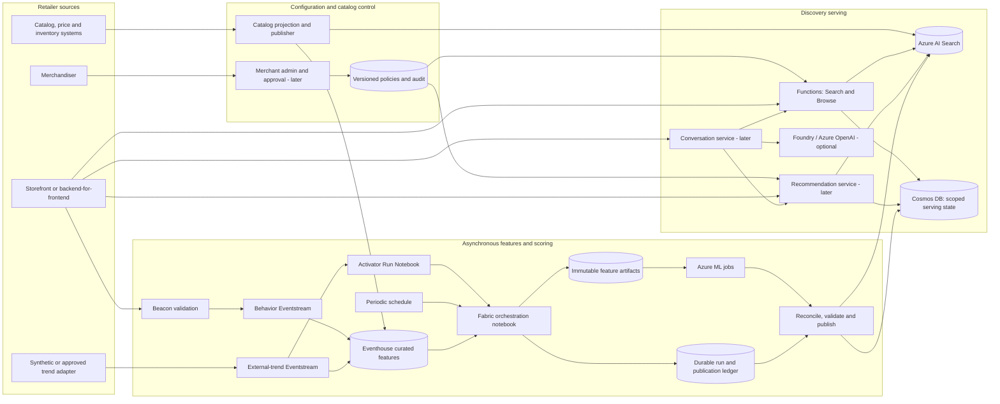
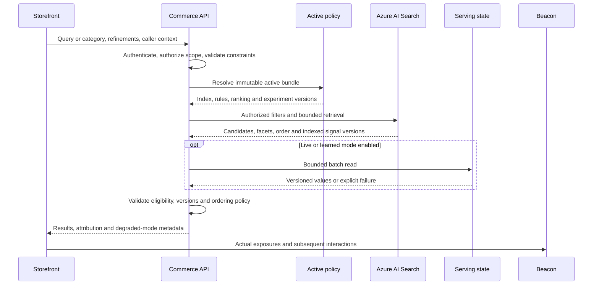
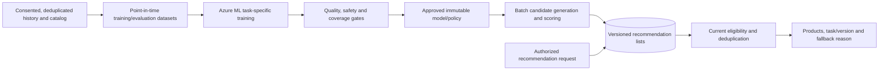

# Azure commerce search platform: proposed design

**Status:** Proposed expansion blueprint; not implemented or benchmarked

**Reviewed:** 28 September 2026

**Research:** [Google commerce search and Azure equivalence](../research/09-google-commerce-search-azure-equivalence.md)

**Initial delivery:** [Current POC and phase gates](../../README.md#build-roadmap)

## 1. Decision and boundaries

Build a single-retailer commerce discovery platform using Azure AI Search for
retrieval and Azure/Fabric services for commerce policy, events and ML. Aim for
functional coverage of Google's commerce-search offering through staged
evidence, not API compatibility or identical proprietary model behavior.

This document **does not supersede the README's POC**. It extends that POC into
a product roadmap. Recommendations, personalization, embeddings, semantic
retrieval and conversations are future capabilities, not newly implemented
defaults. Cart/checkout actions and customer-service agents remain separate.

### Existing foundations versus proposed work

| Area | Repository evidence | Implication |
|---|---|---|
| Catalog | [Synthetic catalog guide](../catalog-data.md), generator/test files and [index definition](../../src/load-generator/azure-search-index.json). | Reuse the seeded 1,000-product catalog. Its presence does not prove deployed search or end-to-end ranking. |
| Public APIs | [Search and Beacon drafts](../api/README.md). | Preserve public event names and service separation. Responses and provider compatibility remain unverified proposals. |
| Trend pipeline | [Option C detailed design](option-c-hybrid-detailed-design.md). | Keep deterministic index-side first, then notebook/ML jobs, validated publication and incremental live reranking. |
| Source ingestion | [Two-stream design](eventstream-ingestion-design.md). | Separate behavior and external-trend Eventstream items; share curated features, not unrestricted credentials or event counts. |
| Learning | [Forecasting research](../research/08-azure-ml-forecasting.md). | Forecasting is a later experiment, not an implemented recommender or search learning-to-rank system. |
| Full commerce platform | This document. | Merchant controls, recommendations, consented profiles, conversation and production operations require further implementation. |

### Scope

**In scope:** search/browse, product and SKU eligibility, facets/suggestions,
merchant controls, behavioral ranking, recommendation families, experimentation,
read-only conversational discovery, and a route to production.

**Out of current implementation scope:** Google Retail API emulation,
production shopper-data collection, social scraping, checkout/payment tools,
autonomous purchasing, SaaS tenant onboarding, global active-active deployment
and any resource provisioning performed just to create these documents.

Use synthetic data for all current work. Any later real-data experiment needs
separate authorization, privacy review and operational readiness.

## 2. Architecture and component ownership

The default is a composed platform, not an all-LLM search engine. Query serving
must not wait for a Fabric notebook or an Azure ML batch job.

The ML-to-publication edge represents **durable reconciliation**, not a native
automatic callback or proof of successful completion. The diagram omits
telemetry edges for readability. Emit correlated telemetry at each boundary.

| Component | Native service contribution | Custom responsibility |
|---|---|---|
| Azure AI Search | Keyword/vector retrieval, filters, facets, suggesters, scoring profiles and optional semantic ranker. | Catalog schema, query policy, field mappings, candidate limits and relevance evaluation. |
| Azure Functions | API and background execution hosting. | Search/Beacon adapters, policy validation, bounded reranking, catalog/score publication and explicit errors. Select hosting plan against latency/network requirements later. |
| Cosmos DB for NoSQL | Serving/configuration storage and concurrency primitives. | Separate containers and schemas for live signals, durable ledgers, serving policies, recommendation lists and optional consented state. TTL is cleanup, not proof of freshness. |
| Fabric Eventstream/Eventhouse | Event routing, raw history and KQL analytics. | Source contracts, deduplication, revisions, catalog joins, watermarks, readiness and feature queries. |
| Activator and Fabric notebook | Qualified condition-to-notebook orchestration. | Trigger coalescing, immutable snapshot preparation, ML submission and durable correlation. No Function solely to launch ML jobs. |
| Azure ML | Reproducible jobs and optional model/endpoint lifecycle. | Scoring/training code, task objectives, feature contracts, evaluation, promotion and rollback. |
| Artifact storage | Durable feature/model/output artifacts through an explicitly selected supported storage path. | Snapshot manifest, immutable naming, hashes, access checks, retention and replay. OneLake access is not assumed for the ML identity. |
| Foundry/Azure OpenAI, later | Supported language/embedding/multimodal models and applicable safety features. | Tool authorization, grounding, scoped conversation, quality evaluation, budgets and deterministic recovery. |
| Entra ID, Key Vault, Azure Monitor/Application Insights | Workload identity, protected secrets and observability primitives. | Effective least privilege, consent policy, redaction, alert rules, service ownership and incident response. |
| Merchant/experiment control plane | Cosmos configuration; optional App Configuration/feature-flag telemetry. | Authoring, approvals, preview, rule compiler, stable assignment, actual exposures and experiment analysis. |

**Not default additions:** Container Apps, Azure Managed Redis, a separate
Event Hubs broker, API Management and Front Door/WAF. Evaluate them when
hosting, ingress, quotas, networking, isolation or measured latency justify
them. Do not add every service to the POC architecture.

Production internet exposure still needs abuse controls and a justified edge
design. "Not default" does not mean production security is optional.

### Options considered

| Option | Assessment |
|---|---|
| Azure AI Search alone | Good retrieval baseline; insufficient for a managed commerce learning loop, recommendation catalog or merchant workbench. |
| Search plus the existing Fabric/ML composition | **Selected.** Reuses POC foundations and makes custom capability ownership explicit. |
| Online ML for every request from the start | Defer. Adds availability, feature freshness and compute-cost dependencies before the batch baseline is proven. |
| LLM generates or orders every product result | Reject as the core path. Hard eligibility, exact identifiers and deterministic serving should not depend on free-form generation. |
| Azure AI Personalizer | Exclude: Microsoft's documented retirement date has passed. See the [research boundary analysis](../research/09-google-commerce-search-azure-equivalence.md#important-azure-boundaries). |

## 3. Logical contracts and authoritative data

These are logical records to formalize when implementing each stage, not new
OpenAPI schemas or claims that existing drafts already support them.

| Record | Key/version information | Invariants |
|---|---|---|
| Catalog projection | Authorized retailer/collection, product ID, SKU/variant IDs, source revision, catalog/schema version and observation time. | Stable keys; declared market/currency; current searchable/stock eligibility; tombstones for removals. |
| Serving policy | Scope, immutable policy ID/version, activation time and referenced index/model/rule versions. | One validated active bundle per context; explicit rollback; no client-selected privileged configuration. |
| Behavior event | Existing event envelope plus scoped event ID, schema version, occurrence/receipt times and known correlation. | Deduplicate before purchase expansion. Search, exposure, order and attribution identities are distinct. |
| Exposure, later | Serving decision, displayed product/panel IDs, positions, filters, experiment assignment and purpose-limited visitor context. | A response is not an exposure. Capture what the UI actually displays under a documented exposure definition. |
| Feature snapshot | Scope/window/correction, catalog version, input-set identity, source readiness and artifact reference/hash. | Immutable, point-in-time valid and readable by the job identity. |
| Product trend | Existing canonical score/version/state/window/expiry and evidence references. | Finite `[0,100]`; preserve the existing version order and publication contract. |
| Recommendation list | Scope, task, seed item or authorized profile key, model/policy/catalog versions, ordered candidate IDs and expiry. | Candidates are not guaranteed currently eligible; revalidate before serving. Never reuse lists across unauthorized identities. |
| Training/model manifest | Task/objective, feature and label versions, dataset split, model asset, metrics and promotion decision. | No future labels in features; no automatic production promotion solely because a job succeeded. |
| Conversation state, later | Authorized session, consent/purpose, validated constraints, product references, policy version and expiry. | History is not authorization; model-generated IDs/filters cannot bypass validation. |

### 3.1 Catalog and variant projection

The retailer's product/inventory/pricing systems remain authoritative.
Azure AI Search is a discovery projection. The synthetic catalog uses parent
products, colourways and purchasable size variants; preserve their distinction.

For Stage B, propose a parent-result projection with correlated variant
attributes sufficient for the promised filters. For example, size, stock and
price must refer to the **same variant**, not independent flattened collections.
Validate a supported complex-collection/filter representation and document-size
limits before changing the index. If a catalog exceeds those limits, evaluate
variant documents and explicit parent grouping as a separate schema decision.

The current flattened `availableSizes` and `isInStock` fields are not proof
that a requested size is in stock at a particular price. Test a parent with
one cheap unavailable variant and one expensive available variant to catch
cross-variant false matches.

Define:

- Parent, colourway and SKU display/deduplication rules.
- Localized searchable text and market-specific price/currency selection.
- Attribute vocabulary, category hierarchy and normalized filter values.
- Inventory/promotion freshness policy and authoritative hydration where the
  experience promises current availability or pricing.
- Full import, incremental revision, tombstone and source-reconciliation flows.
- Catalog ownership of product fields versus score ownership of trend fields.

Do not allow an independent full-document catalog upload to reset newer trend
state. Route writes through coordinated publication ownership or reconstruct
the complete desired document before replacement. Trend writes remain
score-only `merge` operations; reserve full upserts for deliberate catalog
changes. Use one action per document in an indexing batch and handle individual
results. [Search indexing semantics](https://learn.microsoft.com/azure/search/search-how-to-load-search-index)

For schema rebuilds, prepare a new versioned index, catch up catalog changes,
apply the latest valid signals, validate queries and then switch the
application's active index configuration. Preserve rollback data and reconcile
deletions before activation. Do not claim an atomic transaction across index,
policy, feature artifacts and Cosmos containers.

### 3.2 Event and attribution evolution

Keep `POST /v1/search` and `POST /v2/events` separate. Keep public `autoSearch`,
`viewProduct`, `addToCart` and `order` payloads mapped through the existing
[normalization adapter design](../api/README.md#mapping-to-the-pocs-internal-events).

Before learned ranking, propose versioned exposure, filter-selection,
recommendation-panel and authoritative order-outcome extensions. Resolve:

- Actual display definition and whether an impression is viewable or rendered.
- Cart deltas versus snapshots, event counts versus quantities, and returns.
- Attribution window, competing exposures, duplicate orders and missing context.
- Browser versus trusted backend ownership; client-reported prices/orders are
  not proof of financial outcomes.
- Consent state and retention at ingestion, training and serving time.

A proposed opaque serving-decision token links to bounded server-side context
and must be scoped, integrity-protected and expiring. It is not an event ID or
authorization credential. Log unresolved attribution explicitly; never assign
a query-only search event to every retrieved product.

This Azure-native policy is not a claim to resolve the
[Google attribution-documentation inconsistency](../research/09-google-commerce-search-azure-equivalence.md#attribution-and-privacy)
for provider-compatible clients.

## 4. Search and browse serving

### 4.1 Configuration dimensions

Keep these independent:

| Dimension | Initial value | Later alternatives |
|---|---|---|
| Retrieval | Keyword search. | Keyword/vector hybrid, optional semantic reranking, exact-identifier path. |
| Trend mode | Baseline, index-only or index/live hybrid comparison. | Same validated signal lifecycle under expanded retrieval modes. |
| Commerce policy | Required eligibility only for controlled POC comparisons. | Merchant controls, browse policy and explicit sort. |
| Learned/personal mode | Disabled. | Evaluated task-specific ranking; consented personalization. |
| Interface | Direct product results. | Guided facets or conversational wrapper using the same authorized APIs. |

Native hybrid retrieval uses reciprocal rank fusion; it is not the live-store
hybrid. Semantic ranking considers only the top 50 candidates and needs
appropriate text. Do not blend semantic scores for 50 products with unrelated
unreranked scores for another 150 as if they were one calibrated score family.
Initially restrict a semantic reranking experiment to its evaluated semantic
candidate set.

When semantic scoring profiles apply, use the effective response order and
configured score selection, including `@search.rerankerBoostedScore` where
applicable. Agentic retrieval is not a transparent replacement for direct
index queries with these scoring profiles.
[Hybrid retrieval](https://learn.microsoft.com/azure/search/hybrid-search-overview);
[semantic ranking](https://learn.microsoft.com/azure/search/semantic-search-overview);
[scoring-profile behavior](https://learn.microsoft.com/azure/search/semantic-how-to-enable-scoring-profiles).

### 4.2 Request sequence

Detailed ordering:

1. Authenticate caller and authorize retailer/collection. Derive effective
   scope from server-side identity, not an untrusted body/header alone.
2. Validate the query, allowed refinement fields, market/currency, size and
   request limits. Translate a validated filter structure; never concatenate
   arbitrary client/model text into an unrestricted filter expression.
3. Resolve an immutable serving bundle and stable experiment assignment.
   Pin these versions for the request. Apply authorized linguistic controls.
4. Apply mandatory catalog, policy, stock/market and user-selected constraints
   in Search retrieval. Validate redirect rules separately; an invalid or
   disallowed redirect must not become an open redirect.
5. Retrieve a bounded candidate set and needed indexed signal metadata.
   Search failure is an error, not successful empty results.
6. If enabled, batch-read compatible live/personal state. Validate scope,
   versions, finite bounds, input freshness and expiry.
7. Revalidate any current commerce facts promised by this experience.
   Remove now-ineligible candidates; do not insert products that Search did
   not return. Return fewer results with explicit metadata if needed.
8. Apply the selected ordering policy, then eligible pin constraints when
   allowed. Preserve original order and product key for deterministic ties.
9. Return products, facet/count semantics, configuration version, scoped
   attribution and permitted degradation metadata. Do not expose raw profiles
   or internal score evidence to unauthorized clients.
10. Record actual displayed exposures separately through Beacon.

### 4.3 Ranking guardrails

Reuse the [existing ranking specification](option-c-hybrid-detailed-design.md#9-search-and-re-ranking-algorithm):
the canonical `[0,100]` trend score, `1:2:3` behavioral starting weights,
`alpha=0.5`, compatible state versions and bounded incremental adjustment.
Compare live state with indexed values **returned by Search**, not the last
accepted write. Equal snapshots add no trend boost; negative deltas support
decay. The rank-based heuristic does not algebraically undo Search boosting.

Do not add raw trend, model probabilities or recommendation scores to BM25,
RRF or semantic scores. New models need a separately versioned/calibrated
ordering policy and evaluation. Audit feature ownership so a learned model
does not consume trend features and then unintentionally apply the same trend
again through a profile and live adjustment.

For the three-mode benchmark, hold eligibility, query, catalog, candidate
budget and non-ranking configuration constant. Baseline disables optional
trend, personalized and merchant ranking boosts; no default scoring profile
may accidentally activate them. Diagnostic metadata is required for degraded
responses.

### 4.4 Browse, facets, suggestions and pagination

- **Browse:** use a category/collection-constrained query and a documented
  deterministic business order first. Add measured aggregate/learned browse
  ranking later. Do not invent text relevance for a match-all query.
- **Explicit sort:** price/date/user-selected field order takes precedence
  over optional ranking. Disable trend, personalization and pins that would
  contradict it; retain mandatory exclusions and stable key ties.
- **Facets:** initially use Search's query-dependent buckets with a declared
  scope. Label them as retrieval counts; downstream current-stock validation
  can make displayed-result counts differ. Do not promise exact current
  availability counts unless computed with the same eligibility snapshot.
  OR within a selected attribute and AND across attributes is a proposed
  native-platform convention, not a reinterpretation of the legacy draft.
- **Learned facets:** learn which permitted fields/questions to present from
  actual usage, while native Search still computes eligible bucket values.
  Start with configured one-level facets; preview advanced facets are optional.
- **Suggestions:** native product-prefix completion first; a later separate
  query-suggestion index contains curated, sufficiently supported historical
  queries, locale, popularity and validity. Exclude PII, unsafe/rare queries
  and queries with no eligible results. Preserve prefix fallback when the
  learned dataset is absent, with its source identified.
- **Pagination:** keep the POC single-page. Stage B multi-page custom ordering
  requires a fixed ranking snapshot and opaque signed cursor bound to
  scope/query/filters/policy, with expiry and current-eligibility rechecks.
  No fresh independent rerank for each offset page. Expired snapshots produce
  an explicit restart response; do not silently substitute new ordering.

Current facts and exact-price promises require an available authoritative
source or a validated freshness policy. If that condition cannot be met, do
not label products as confirmed purchasable or fabricate a price.

## 5. Merchant policy and administration

Treat the merchant workbench as a first-class **custom** capability. An Azure
portal and a collection of scoring profiles do not provide it.

### 5.1 Rule precedence

Proposed Stage B precedence, evaluated against one policy version:

1. Authorization, legal/catalog exclusions and current eligibility.
2. User refinements, category/market scope and validated linguistic policy.
3. Approved redirect, if allowed for this query/context.
4. Explicit user sort, when supplied.
5. Otherwise the configured relevance/browse/learned ordering with bounded
   business and trend contributions.
6. Eligible pin placement, only when compatible with the chosen sort mode.

No boost/pin may undo an exclusion, widen a selected filter or create a
product outside the retrieved candidate set. A missing pinned product is a
visible rule non-application reason, not an invitation to fetch an unrelated
item. This is a deliberate limit versus broader pinning expectations.

Reject conflicting pins or invalid ranges at policy publication. Resolve
overlapping nonconflicting rules by explicit priority and stable rule ID.
Do not rely on database enumeration order. Limit compiled rule size and
candidate operations; the exact limits must be configured and load-tested.

### 5.2 Lifecycle

`Draft -> Validated -> Previewed -> Approved -> Active -> Retired`

- Merchandiser authors synonyms, facet choices, boosts, exclusions, pins,
  redirect targets, time windows and approved clarification questions.
- Validator checks referenced catalog fields/products, allowed actions,
  conflicting pins, redirect hosts and effective market/scope.
- Preview runs a judged query set against the draft and current policy and
  shows changed ranks, constraints and reasons.
- A separately authorized approver activates an immutable policy bundle.
  Record actor, reason, version and activation/audit evidence.
- Reject activation until required indexes/models/artifacts are available.
  Roll back the active pointer to a still-valid compatible bundle on failure.
- Cached configuration has a validity deadline. A last-known-good version
  may be used only while valid; unknown mandatory eligibility policy fails
  closed. Do not silently use an empty ruleset.

Native synonym maps are referenced by index fields, not arbitrary per-request
policy bundles. If an experiment requires incompatible synonym maps, plan
separate index configurations or an explicitly tested application rewrite
strategy; do not pretend version metadata makes mutable shared maps isolated.

## 6. Event, feature and score lifecycle

Retain [Option C](option-c-hybrid-detailed-design.md) and the
[two-stream contract](eventstream-ingestion-design.md), including:

1. Source-specific validation/rejection, behavior event deduplication before
   item expansion, and external latest-revision resolution before eligibility.
2. Whole attribute predicates: blue AND jackets, not independent boosts for
   blue products and jackets.
3. Per-source readiness and watermarks. Idle external input is not failure;
   missing behavior is not a zero-activity feature. New inputs for a previous
   window require a correction/input-set revision.
4. Coalesced scheduled/Activator triggers by scope, window and scoring policy;
   cooldown/concurrency limits, not one notebook or job per click.
5. Immutable feature artifacts and an explicit ML-identity read check.
6. Durable submission intent and stable job identity; reconcile an ambiguous
   submission before retrying.
7. Scheduled terminal-state reconciliation. Success, failure, cancellation,
   timeout and unknown status have explicit outcomes; the notebook need not
   remain running.
8. Artifact validation and independent Search/live-store publication results.
   Retry publication from the artifact without recomputing the ML job.
9. Ordering by feature window and correction/policy semantics, not job finish
   time. Cosmos uses conditional ownership/writes; Search publishing is
   serialized/coordinated with latest-desired-state repair after ambiguous
   outcomes, not assumed per-document compare-and-set.
10. Clock-driven expiry and clearing of previously boosted Search documents.
    Do not refresh `lastTrendingAt` merely because a job ran.

Activator's Run Notebook action is documented; parameter passing is preview.
Validate actual parameter types and values at notebook entry. Use fixed,
validated configuration plus the durable ledger or the periodic route if
preview parameters are not approved. No guessed alert payloads or silent
numeric/boolean defaults.
[Official action guidance](https://learn.microsoft.com/fabric/real-time-intelligence/data-activator/activator-trigger-fabric-items)

Behavior starts with periodic feature runs. External qualified hints can
trigger the notebook but must wait for corresponding Eventhouse readiness.
An Eventhouse aggregate does not automatically feed an Activator rule:
explicitly configure the selected feed/query path and measure its cadence.

Training is a separate workload from routine scoring. Admit training only
after readiness checks and evaluation definitions exist. Keep its compute and
concurrency budget from starving score publication.

## 7. Recommendation and learned-ranking extensions

### 7.1 Batch-first architecture

Begin with reproducible non-personalized lists and transparent baselines:
catalog-similar products, sufficiently supported co-view/co-purchase lists and
category popularity. Azure ML jobs can later train task-specific models and
publish versioned outputs to a **separate recommendation container**, not the
canonical product-trend field.

For query-conditioned learned ranking, Search still retrieves candidates.
A custom model operates only on those eligible candidates under an explicit
feature/ordering contract. Precomputed global scores alone do not reproduce
query-conditioned ranking.

For a standalone recommendation endpoint, the approved task defines its own
candidate generator. Batch-hydrate/filter those candidate IDs through the
catalog/Search eligibility path. This is not permission to inject recommended
products into an unrelated Search result.

This diagram describes custom orchestration, not a prebuilt Azure recommender.
Training success does not activate a model. Validate outputs and use the
durable publication/recovery discipline from the POC.

### 7.2 Task-specific progression

| Task | Baseline | Later learned capability / key gate |
|---|---|---|
| Similar products | Catalog attribute similarity. | Evaluated embeddings/multimodal similarity; compatible model/vector versions and relevance judgments. |
| Others you may like | Co-view lists with support thresholds. | Context/sequence models; next-item metrics without time leakage. |
| Frequently bought together | Deduplicated basket associations. | Complement ranking; exclude duplicate variants and account for order reversals. |
| Recommended for you | Explicit non-personalized fallback. | Consented profile/session modeling with sufficient support and privacy checks. |
| Buy again | Eligible purchase-history rules. | Recurrence model for suitable products; never assume every fashion item is replenishable. |
| On-sale | Promotion-valid category lists. | Consented promotion ranking; authoritative price/market/date checks. |
| Recently viewed | Bounded ordered history. | No model necessary; profile scope, expiry and deletion tests. |
| Panel orchestration | Fixed panels, duplicate suppression. | Evaluated panel selection/order; actual panel exposures and bounded fan-out. |

Define each objective independently: next click, purchase, complement
relevance or repeat purchase. Do not interpret a click probability as expected
revenue or optimize margin without an approved business policy.

Use temporal train/validation/test separation, point-in-time catalog and
features, exposure-aware negatives and cohort support reports. Treat position
bias, feedback loops, bots and missing events as model-quality risks. A more
complex model is promoted only when it improves declared metrics without
violating eligibility, diversity or serving-cost guardrails.

### 7.3 Fallback and optional online serving

Missing/expired model lists may use an explicitly configured, eligible
non-personalized baseline with `fallbackReason`. A valid list with no eligible
products can yield an explicitly empty recommendation panel; a dependency
failure is not silently classified as "no products."

Do not manufacture "because you liked..." explanations on fallback.
Recommendations must not prevent core search from serving when their optional
dependency fails.

Introduce an Azure ML online endpoint only if batch/context features miss a
measured requirement. Design feature retrieval, capacity, request deadline,
circuit breaking, shadow evaluation and fallback separately.
[Online versus batch inference](https://learn.microsoft.com/azure/machine-learning/concept-endpoints?view=azureml-api-2)

## 8. Governed conversational discovery

Use the existing Search/Recommendation APIs as validated tools rather than
granting an LLM direct database queries or broad catalog mutation permissions.
Start with approved facet questions before generating free-form conversations.

Proposed interaction:

1. Authenticate/scope the session and load only permitted, unexpired context.
2. Extract a proposed intent and structured constraints from the shopper text.
3. Validate constraint names/types/ranges against a catalog vocabulary;
   preserve explicit shopper restrictions and clarify conflicting constraints.
4. Call the same authorized Search/Browse or Recommendation API. A model cannot
   invent a retailer scope, bypass stock/market restrictions or widen filters
   without a clear shopper decision.
5. Generate an answer using only returned product IDs and current validated
   facts. Comparisons link back to catalog products and evidence fields.
6. Validate generated product references and material claims. Reject invented
   prices, discounts, stock, attributes or product IDs.
7. If facts are insufficient, ask a grounded clarification or show the
   deterministic result list with an explicit generation failure/degradation.
   If Search itself fails, surface the error rather than a fabricated answer.

Use structured output/tool schemas where the selected model/API supports
them. Schema validation is not factual validation. Treat descriptions,
supplier text, reviews, external signals and tool responses as untrusted
content, not instructions. Evaluate prompt injection, harmful text, irrelevant
answers and unauthorized tool requests with application-level enforcement
plus supported safety features.
[Structured outputs](https://learn.microsoft.com/azure/ai-foundry/openai/how-to/structured-outputs);
[Prompt Shields](https://learn.microsoft.com/azure/ai-foundry/openai/concepts/content-filter-prompt-shields).

Set explicit configurable limits on turns retained, tokens, tool fan-out,
candidate payload, request time and cost. Select the exact model/version,
API, deployment type, region and retention settings before implementation;
preview models/features need a separate approval and exit path.

Optional image-led discovery requires a validated model and versioned catalog
image representations. Do not infer searchable image embeddings from the
existing optional image-generation workflow.

**No transactional tools:** no add-to-cart, payment, checkout, loyalty mutation
or purchase commitment in this design. A later extension needs explicit user
confirmation, backend authorization, idempotency and transaction audit.

## 9. API evolution and client behavior

| Surface | Proposed evolution | Compatibility boundary |
|---|---|---|
| Search | Existing endpoint plus a separately reviewed versioned capability plan for browse, policy and diagnostic metadata. | Do not silently change provider-facing response names or refinement semantics. |
| Beacon | Existing event names normalized internally; future exposure/panel/filter/outcome schemas. | Distinguish client observations from backend-confirmed orders; explicitly negotiate new event versions. |
| Suggestions | Separate read operation for prefix/product or curated-query suggestions. | Return suggestion type and safe filter intent; selecting a suggestion is not proof of purchase intent. |
| Recommendations | Separate task/context operation with bounded result count and scoped attribution. | Recommendation candidates do not replace the Search candidate contract. |
| Merchant administration | Authenticated draft/preview/approve/publish/rollback operations. | Never expose administrative credentials or rules mutation to shopper clients. |
| Conversation | Separate session/turn interface wrapping discovery tools. | Preserve direct non-generative search; session IDs are not authority. |

These are conceptual surfaces, not new committed endpoint paths. Extend the
OpenAPI drafts only in a dedicated contract task once behavior, defaults,
limits, ingress trust and client migration are agreed.

Browser clients must not receive backend keys, Fabric source credentials,
Search administrative credentials or model credentials. Resolve CORS and
browser event transport deliberately; the service name Beacon does not
guarantee compatibility with `navigator.sendBeacon()`.

## 10. Identity, privacy and future tenant isolation

### Single-retailer starting point

- Separate development/test/production resources and synthetic fixtures.
- Use Entra identities and least-privilege roles where supported. Validate
  notebook-to-ML, ML-to-artifact, publisher-to-Search/Cosmos and producer-to-
  Eventstream access independently.
- Separate source credentials and restrict writes by component ownership.
  Prefer managed identity; approved unavoidable secrets live in Key Vault.
- Resolve authorized collection/market scope server-side. Public customer IDs
  and anonymous visitor IDs are claims, not access control.
- Enforce browser abuse controls and trusted-backend validation for events
  used as financial or recommendation labels.
- Treat pseudonymous histories as privacy-sensitive. No secrets, raw personal
  queries or unnecessary profiles in logs or notebook outputs.

### Consented state

Before enabling personalization, define lawful basis, purpose and retention
with the retailer. Provide an unpersonalized path; withdrawal disables use of
profile features at serving and ingestion, not just in the UI.

Track deletion/withdrawal through raw events, features, history stores,
recommendation lists, conversation state and retained training artifacts.
Document how already-trained models are handled, including retraining or
unlearning decisions where required; do not promise instant removal from
weights. Legal retention exceptions require an explicit policy.

An Entra OAuth consent grant authorizes API access; it is not sufficient
evidence of shopper tracking/personalization consent.

### Future SaaS boundary, not an onboarding implementation

Carry authorized retailer/collection scope through keys, ledgers, artifacts,
policies, quotas, caches and diagnostics now. Later compare index-per-tenant
with service-per-tenant isolation, limits, noisy-neighbor exposure and cost.
[Microsoft multitenant Search patterns](https://learn.microsoft.com/azure/search/search-modeling-multitenant-saas-applications)

Do not silently convert the POC to a shared multi-tenant index. Shared
resources require tested enforcement; separate indexes alone do not grant
shoppers authorization. Training data, model artifacts and serving lists must
not mix merchants unless separately authorized.

Cache keys must include effective scope, locale/market, query/filters, policy,
retrieval mode and relevant consent/profile context. Disable shared
personalized-response caching; never replay another visitor's attribution
token. Aggregate caches also need freshness/version and invalidation rules.

## 11. Failure handling and operations

| Condition | Required serving or pipeline outcome |
|---|---|
| Search unavailable/timed out | Explicit service error; no fabricated empty success or LLM-invented products. |
| Live trend store unavailable/stale | Preserve returned index ordering, report degraded mode and age/reason. |
| Unknown/incompatible indexed or live version | Skip optional adjustment with a diagnostic; do not guess the indexed score. |
| Mandatory policy unavailable/expired | Fail closed; a still-valid approved bundle may be used with explicit version/degradation. |
| Price/stock authority unavailable | Apply the declared freshness policy; suppress unsupported current-fact claims or fail the operation if current eligibility is mandatory. |
| ML submission uncertain | Reconcile durable submission/job identity before creating another attempt. |
| Job failed/cancelled/timed out | Mark ineligible for publication; retain prior valid output only until its own expiry. |
| Invalid artifact or older completion | Reject/quarantine with reason; never publish because completion was recent. |
| Partial Search/Cosmos publication | Track destinations independently and retry from validated artifacts under latest-state ownership. |
| External signal idle or retracted | Distinguish healthy idleness from outage; resolve latest revision and clear affected boosts. |
| Recommendation list absent/expired | Declared eligible baseline or explicit unavailable panel; record fallback, not synthetic personalization. |
| Learned suggestions absent | Labeled product-prefix completion if its dependency is healthy. |
| Conversation/model failure | Explicit deterministic discovery fallback if Search succeeded; otherwise a real error. |
| Rate/capacity pressure | Bounded backoff and admission control; shed optional work before core search and never retry indefinitely. |

### Telemetry and recovery

Trace authorized scope, correlation/event IDs, catalog/feature/policy/model
versions, job IDs/status, destination outcomes and sampled rank changes.
Record:

- Event occurrence to ingestion and Eventhouse visibility.
- Feature-window readiness and notebook queue/startup.
- ML queue/provisioning, execution and reconciliation delay.
- Publication acceptance and actual query visibility.
- Search, state reads, hydration, reranking, recommendation and conversation
  latency separately, with p50/p95 and sample counts.
- Source health, stale-state ratios, invalid artifacts, fallback/error rates,
  cost drivers and retry amplification.

Use bounded-cardinality metrics and sampled redacted traces. Keep an auditable
control history without turning raw shopper text into metric dimensions.

Rehearse rebuilding indexes/live lists from durable catalog and validated
artifacts, restoring run/publication ledgers, replaying events without double
counting, and rolling back model/policy versions. Define RPO/RTO with the
retailer before production; none is established by this blueprint.

### Deployment feasibility

Before deployment, choose and record:

- Region/residency, data retention, supported model and non-preview/approved
  preview features.
- Search tier, Functions hosting/networking, Cosmos capacity/partitioning,
  Fabric capacity and ML compute quotas.
- Identity and network connectivity for each integration; private endpoints
  do not automatically make cross-service notebook access work.
- Owner, budget, environment boundaries, recovery and teardown procedures.

Bicep covers supported Azure resources. Use supported Fabric APIs or explicit
manual setup/exports for Fabric items; do not invent ARM types or deployment
support. No resources are authorized by this design document alone.

## 12. Phased delivery and acceptance

These stages extend, rather than renumber, the README's POC phases.

| Stage | Dependencies and deliverables | Exit evidence |
|---|---|---|
| **A: prove the existing POC** | Finish README phases 0-4: catalog/index setup, validated two-stream ingestion, deterministic aggregation, index-side expiry, then ML lifecycle and live delta. | Same query/filters/catalog before/during/after SKU and compound-attribute spikes in all three modes; deduplication, score bounds, stale-job prevention, partial-write recovery and outage behavior verified. Report actual latency against existing targets. |
| **B: commerce search foundation** | A provides a trusted baseline. Add variant-correct catalog projection, browse/sort/facets, native suggestions, merchant controls/workbench and contract evolution. | Judged retrieval set; zero hard-filter/variant violations in fixtures; explicit rule conflicts/non-application; safe redirects; reproducible preview/approval/rollback and stable paging within a bounded snapshot. |
| **C: learning and recommendations** | B plus exposure/outcome schemas, readiness dashboard and point-in-time data. Build transparent recommendations, learned suggestions/facet selection, then evaluated recommendation/query-ranking models. | Task-specific held-out metrics beat the registered baseline without violating coverage/eligibility/cost guardrails; no future-data leakage; cold-start and partial-publication tests pass. Synthetic evaluation is labeled synthetic. |
| **D: personalization and conversation** | C plus privacy/consent/deletion policy, sufficient authorized histories and exact supported model/API selection. Add scoped profiles, guided discovery and grounded conversations. | No unauthorized cross-profile use; withdrawal path verified; generated product/fact validation, prompt-injection and model-outage tests pass; deterministic search remains independently available. |
| **E: production hardening and expansion** | Prior capability gates plus real workload, region/SLO and budget decisions. Load/soak tests, edge/network controls, operational ownership, recovery and optional SaaS architecture. | Measured peak/steady latency and costs, incident/restore/rollback exercises, agreed SLOs and documented residual gaps. Multi-tenant onboarding or transactional agents require separate design approval. |

Operational correctness must be built with each stage; Stage E is production
qualification, not permission to defer authentication or data correctness.
Semantic/vector and image experiments fit B/D only after keyword baselines
exist and have an evaluation need. Model complexity is not itself an exit gate.

### 12.1 Evaluation protocol

Maintain immutable evaluation manifests: catalog seed/version, query set,
labels, event scenarios, policy/model versions, request counts and run identity.
Include exact SKUs, head/tail queries, synonyms/typos, compound attributes,
category browse, price/size constraints, no-result queries and supported
locale examples.

| Area | Proposed measurement | Acceptance rule |
|---|---|---|
| Retrieval | Recall@50 for the semantic candidate experiment; NDCG@10 for judged first-page ranking, with counts and query cohorts. | Register baseline and non-regression threshold before tuning. Do not claim superiority without identical eligible data and a frozen holdout. |
| Hard correctness | Product/variant filter checks, authorization, price/market consistency, duplicate IDs and expired-state use. | Zero violations in the acceptance fixtures; investigate every production violation rather than averaging it into relevance. |
| Trend POC | Before/during/after movement, equal-state no-double-boost, expiry, ties and duplicate/late/retracted events. | Preserve current deterministic invariants and report misses against the README targets. |
| Recommendations | Recall@10/NDCG@10 by task, catalog coverage, diversity, valid-list rate and cold-start cohorts. | Improve the declared task baseline without introducing ineligible items or unsupported personalized claims. |
| Conversation | Valid product-ID rate, grounded price/attribute checks, clarification/task completion, refusal/error/fallback rate and adversarial scenarios. | Zero invented IDs/prices in the release fixtures; all unauthorized tool attempts denied; report measured grounding failures, not a blanket safety guarantee. |
| Latency/freshness | End-to-end and per-stage p50/p95, sample count, errors and cold/warm cases. | POC retains its 1-5 minute index-side target and other existing budgets. Production SLOs require workload approval; job freshness is not online latency. |
| Economics | Full infrastructure cost per 1,000 completed discovery requests, plus training and engineering cost reported separately. | Budget agreed before deployment; include idle capacity, optional model calls, retries and peak-load headroom. |

Metrics with a cutoff use fewer results when the eligible set is smaller;
record that denominator and the fraction of affected cases. An empty judged
set is not a perfect score.

### 12.2 Experiments and commercial evidence

Use stable, scope-bound assignment at the chosen shopper/session unit. Record
assignment, actual exposure, policy/model version and outcomes separately.
Feature-flag evaluation telemetry alone does not prove that a recommendation
was seen.
[Feature-flag telemetry](https://learn.microsoft.com/azure/azure-app-configuration/howto-telemetry)

Before a real experiment, preregister its primary metric, attribution window,
sample-size/power assumptions, stopping rule and guardrails. Inspect assignment
imbalance, bot traffic, novelty effects, page latency and category cohorts.
Do not stop at the first positive result or substitute revenue forecasts for
observed incremental revenue.

The synthetic POC can validate experiment plumbing, not conversion or revenue
lift. A Google comparison needs an authorized comparable test environment,
identical catalog/query eligibility and documented configuration/readiness
differences; no provider resources are assumed available here.

## 13. Cost model and open decisions

Estimate the composition, not only Azure AI Search. Use the
[research economics model](../research/09-google-commerce-search-azure-equivalence.md#economics-and-operating-comparison)
to capture:

- Search capacity and enabled semantic/vector-related processing/storage.
- Fabric capacity, event retention and always-active query/aggregation cost.
- ML training/scoring and optional online endpoint idle capacity.
- Functions, Cosmos reads/writes/storage, artifacts and telemetry.
- Optional embeddings/conversations, safety/evaluation, ingress and networking.
- Merchant UI/model lifecycle implementation and on-call ownership.

Report a workload-based range rather than choosing the cheapest isolated
service price. Existing enterprise capacity is not automatically free:
distinguish marginal spend from consumed capacity and opportunity cost.
The costing baseline is a supported Dedicated Search tier. The documented
Serverless Developer tier is preview with different compute/storage billing
and no preview SLA; it is not a production-default shortcut around capacity
planning. See [Search cost guidance](https://learn.microsoft.com/azure/search/search-sku-manage-costs).

| Open decision | Owner / evidence needed before implementation |
|---|---|
| Retailer catalog/market scope and peak workload | Product/platform owner; product/variant counts, QPS, update rates, locales and payloads. |
| Runtime/SDKs and hosting plan | Engineering; preserve existing generator tooling but choose service stack from supported versions and deployment needs. |
| Ingress trust and real event collection | Security/commerce owner; authenticated backend/browser design and authoritative outcome source. |
| Latency, freshness, availability, RPO/RTO | Product/SRE; measured POC and explicit production commitments. |
| Price/stock freshness and variant schema | Commerce/search owner; correlated eligibility fixtures and authoritative-source availability. |
| Consent, retention and deletion/model policy | Retailer privacy owner; purpose and lifecycle obligations, including later real-data use. |
| ML objective, features, model and promotion thresholds | Search/ML owner; readiness and frozen evaluations, not model-name preference. |
| Generative model/API/region and preview appetite | Platform/security owner; supported capability matrix, evaluations and data terms. |
| Production edge, capacity and budget | Platform/SRE/finance; load measurements and dated regional pricing. |
| SaaS or transactional expansion | Separate product/security decision; not implicitly approved by this blueprint. |

## 14. Documentation and implementation handoff

The next engineering task should select a bounded README milestone, formalize
its affected contracts and add implementation/tests using the repository's
actual tooling. Do not scaffold all stages at once.

For capability evidence and known Google/Azure gaps, use the
[comparison and source register](../research/09-google-commerce-search-azure-equivalence.md#source-register).
For low-level trend, ingestion and publication contracts, use the existing
[Option C](option-c-hybrid-detailed-design.md) and
[two-stream](eventstream-ingestion-design.md) designs.

Keep proposed, implemented and measured status separate as work progresses.
Update install/run/test/demo/recovery instructions only when commands and
behavior exist and have been verified.
