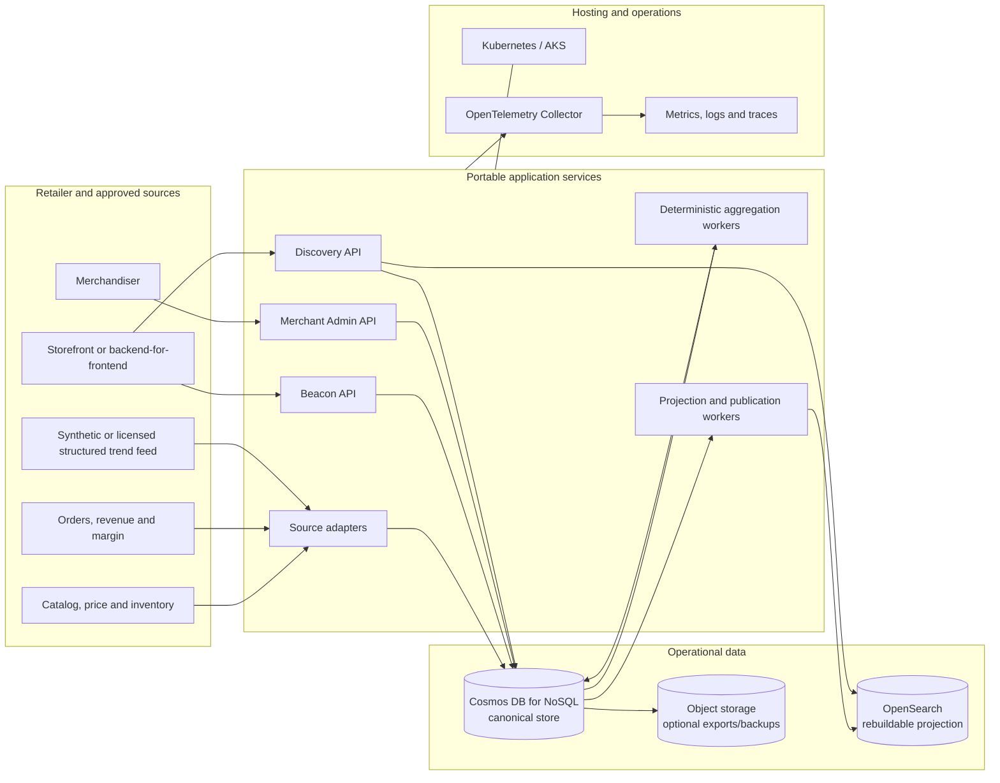
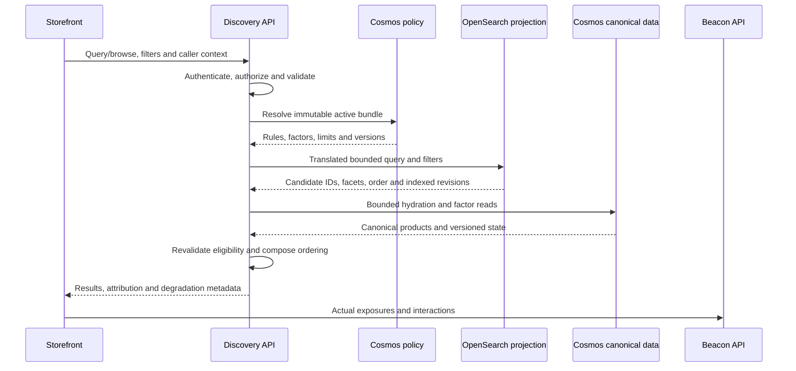

# Commerce discovery platform: Cosmos DB target design

**Status:** Proposed full-platform blueprint; the keyword Search POC exception is implemented and live-verified

**Reviewed:** 5 October 2026

**Repository guide:** [Selected architecture and local tooling](../../README.md#architecture)

**Approved Search POC exception:** [Cosmos Search gap analysis and backlog](cosmos-search-poc-backlog.md)
and [runtime runbook](../../src/search-api/README.md) define a local/containerized
Python/FastAPI implementation of the existing Search contract using Cosmos
native English full-text/BM25 rather than OpenSearch. It uses a dedicated,
immutable 1,000-product synthetic import, parent-plus-variant documents and
bounded paging. The [live verification evidence](../../infra/README.md#deployment-and-live-verification-evidence)
covers synthetic import, real HTTP requests and bounded concurrent Cosmos
queries; it does not establish the wider platform or production performance.
The image-hosted `catalog-images-001` snapshot stores relative blob paths;
the API resolves URLs from environment-specific storage configuration.
Offline verification alone is not proof of cloud integration.
The separately approved catalogue expansion may use an existing MAI deployment
for offline synthetic photographs only. It preserves the original catalogue and
targets up to 2,000,000 parent products. Retaining the POC's `/scopeId` partition
layout is conditional on capacity and query evidence; it does not override the
production partitioning principles below. See the
[expansion runbook](../catalog-data.md#large-catalogue-expansion).
Beacon, merchant administration and the broader pipeline below remain designs.
An optional embedding/vector/hybrid experiment requires separate authorization
and matching/count decisions; the baseline does not enable those capabilities.

## 1. Decision and boundaries

Build a single-retailer commerce discovery platform with:

- Azure Cosmos DB for NoSQL as the canonical operational data store.
- Containerized, portable application services and workers.
- OpenSearch as a replaceable keyword-search projection, not a source of truth.
- Deterministic rules, aggregations and ranking only.
- OpenTelemetry, OpenAPI, OCI images, Kubernetes and Helm for portable
  interfaces and deployment artifacts.

Do not use Azure AI Search, Azure Machine Learning, Microsoft Foundry,
Azure OpenAI, semantic or vector retrieval, embeddings, generative
conversation, model-based extraction, or learned ranking/recommendations.
Microsoft Fabric is also removed from the target because its Eventstream,
Eventhouse, Activator and notebook path creates avoidable platform coupling.

Azure remains the initial hosting environment. Cosmos DB is an intentional
Azure dependency selected by the customer. Managed identity, Key Vault,
Azure Monitor and AKS may be used as hosting or operational integrations, but
the domain and ranking code must not depend on them directly. Every such
integration sits behind a narrow adapter with a documented portable
alternative.

This document replaces the service choices in the historical
[Option C design](option-c-hybrid-detailed-design.md), the
[Eventstream ingestion design](eventstream-ingestion-design.md), and the
[Google equivalence research](../research/09-google-commerce-search-azure-equivalence.md).
Those documents remain evidence of previous decisions only. Their enduring
correctness rules are carried forward here where applicable.

### 1.1 Existing foundations versus target work

| Area | Repository evidence | Target implication |
|---|---|---|
| Catalog | [Synthetic catalog guide](../catalog-data.md), generator/tests and an Azure AI Search index file. | Reuse the synthetic products and generator. Replace the Azure AI Search batch/index output with Cosmos catalog documents and an OpenSearch projection in a separate implementation task. |
| Public APIs | [Search and Beacon drafts](../api/README.md). | Preserve public camelCase fields, public event names and Search/Beacon separation. The storage and search engines remain internal. |
| Ranking | Historical deterministic trend scoring, publication and live-reranking designs. | Preserve bounded scores, deduplication, revisions, expiry, conditional publication, explicit partial failure and deterministic ties. Remove all job/model lifecycle. |
| Ingestion | Historical two-source separation and normalized event envelope. | Preserve source isolation and validation, but write accepted events to Cosmos through portable HTTP services and process them with containerized workers. |
| Full platform | This document. | Search, browse, merchant policy, deterministic recommendations, privacy controls and operations require implementation. |

### 1.2 Scope

**In scope:** keyword search, browse, exact identifiers, product/SKU
eligibility, filters, facets, prefix suggestions, merchant rules,
deterministic trend and business factors, non-learned recommendations,
experimentation, consented rule-based preferences, guided discovery and a
route to production.

**Out of scope for serving:** AI services of any kind, model training/inference,
embeddings, image understanding, free-form conversational discovery,
autonomous agents, checkout/payment tools, social scraping, SaaS onboarding,
global active-active deployment and resource provisioning performed merely to
write this design.

Use synthetic data for current work. Real shopper data, provider data, cloud
mutations and paid calls require separate authorization, privacy review and
operational readiness.

### 1.3 Portability rules

1. Domain services depend on application-owned ports such as `CatalogStore`,
   `EventStore`, `PolicyStore`, `SearchProjection` and `TelemetrySink`.
2. Cosmos-specific partition keys, `_etag`, continuation tokens, transactional
   batches and change-feed leases remain inside the Cosmos adapter.
3. Search requests use an application-owned query/filter AST. The OpenSearch
   adapter translates only allow-listed operations; public clients never send
   raw engine queries.
4. Services ship as OCI images and receive configuration through environment
   variables or mounted files. Health probes, graceful shutdown and
   OpenTelemetry use vendor-neutral protocols.
5. Kubernetes manifests and Helm values avoid AKS-only APIs unless a separate
   optional overlay documents the dependency and fallback.
6. Business workflows do not require the Azure portal. Infrastructure uses
   declarative provisioning; operational runbooks use standard APIs and CLIs.
7. Cosmos is not hidden behind a lowest-common-denominator abstraction.
   Required concurrency and partition behavior are explicit, while the
   domain contract remains portable.

## 2. Architecture and component ownership



The data flow is deliberately asymmetric:

- Cosmos owns catalog, policy, event, factor, recommendation, profile and
  control records.
- OpenSearch owns no authoritative business state. It can be deleted and
  rebuilt from a pinned Cosmos snapshot plus subsequent changes.
- Search returns candidate IDs and indexed snapshots. The Discovery API
  hydrates authoritative product data from Cosmos in bounded batches and
  revalidates eligibility before returning results.
- Workers perform deterministic aggregation and publication. There is no
  notebook, training job, endpoint or generated-content path.

| Component | Responsibility | Portability boundary |
|---|---|---|
| Discovery API | Search/browse/suggestions, policy resolution, authoritative hydration, eligibility checks, bounded factor composition and response attribution. | Stateless OCI service; application-owned query and store interfaces. |
| Beacon API | Authenticate/validate events, normalize public camelCase events into the internal envelope, reject or accept explicitly and persist idempotently. | HTTP/OpenAPI plus `EventStore`; no browser database credentials. |
| Merchant Admin API | Draft, validate, preview, approve, activate and roll back immutable policies. | HTTP/OpenAPI plus policy and audit ports. |
| Source adapters | Poll or receive catalog, commerce and structured trend data; preserve source revisions and retractions. | One adapter per source; no source-specific fields in ranking core. |
| Aggregation workers | Deduplicate, close ready windows, compute deterministic features/factors/recommendations and expire obsolete state. | Containerized scheduled or continuously running workers; pure calculation library tested offline. |
| Publication workers | Consume Cosmos changes, project documents to OpenSearch, inspect item-level bulk results and repair partial publication. | `SearchProjection` adapter; idempotent desired-state records in Cosmos. |
| Cosmos DB for NoSQL | Canonical documents, optimistic concurrency, transactional batches within a partition, TTL cleanup and change feed. | Intentional Azure dependency isolated in a data adapter. TTL never proves business freshness. |
| OpenSearch | BM25 keyword retrieval, exact fields, filters, facets, prefix completion and deterministic engine-side sorts. | Replaceable projection accessed only through `SearchProjection`. No vectors, neural plug-ins or generated queries. |
| Kubernetes / AKS | Scheduling, scaling, probes, secrets mounting and network policy. | Standard Kubernetes first; AKS-specific identity/networking in overlays. |
| OpenTelemetry | Vendor-neutral traces, metrics and log correlation. | Export destination is configuration, not domain code. |
| Entra ID and Key Vault | Initial workload/user identity and protected secret integration. | OIDC/OAuth 2.0 and secrets-provider adapters; prefer workload identity. |

### 2.1 Options considered

| Option | Assessment |
|---|---|
| Cosmos DB only, including text retrieval | Reject for the target experience. Cosmos is the canonical store but is not the selected full-text relevance/faceting engine. Application-side scans are not acceptable. |
| Cosmos DB plus OpenSearch | **Selected.** Cosmos remains authoritative while OpenSearch provides portable, rebuildable keyword retrieval. |
| Azure AI Search or other AI-labeled search service | Excluded by customer decision, including use limited to lexical features. |
| PostgreSQL as both store and search | Not selected because Cosmos DB is the required target store. |
| Fabric/Eventhouse pipeline | Excluded. It is unnecessary for deterministic aggregation and increases platform coupling. |
| Kubernetes-native Kafka/Flink from day one | Defer. It adds a large operational surface before throughput proves Cosmos change feed and workers insufficient. |
| Generated conversation or learned ranking | Excluded. Guided facets and deterministic rules provide the supported discovery path. |

## 3. Cosmos DB data design

### 3.1 Account, database and consistency

Start with one Cosmos DB for NoSQL account per environment and one operational
database. Production topology, regions and capacity require measured workload
evidence. Do not claim multi-region readiness from an account setting alone.

- Use session consistency by default. Carry the session token when a workflow
  requires read-your-writes across service calls.
- Use `_etag` with `If-Match` for conditional updates and ownership claims.
- Use transactional batches only when all affected documents share a logical
  partition key.
- Do not implement cross-container transactions. Use durable intent/state
  records and idempotent reconciliation.
- Define request-unit, storage and hot-partition budgets per container.
- Prefer autoscale for uncertain bursty workloads only after comparing its
  minimum cost with measured provisioned demand.
- Enable continuous backup for production if its recovery objectives and cost
  are approved. Practice restore into a separate account.

### 3.2 Container map

Names are logical and may be adjusted before provisioning. Every document has
`id`, `schemaVersion`, `scopeId`, `partitionKey`, `createdAt` and `updatedAt`.
Times are UTC ISO 8601 values. `partitionKey` is an application-computed,
versioned routing value so the physical key strategy is visible and testable.

| Container | Typical records | Partition key strategy | Retention and notes |
|---|---|---|---|
| `catalog` | Product aggregate, variants, tombstones and source revision. | `scopeId|productBucket`; bucket is stable from product ID. | No TTL for active products. Tombstones retained through projection/replay requirements. |
| `events` | Normalized behavior and external observations. | `scopeId|yyyyMMdd|shard`; shard is stable from event ID. | TTL by approved raw-event retention. Business expiry is a field, not inferred from TTL. |
| `serving-state` | Product factors, indexed snapshots, deterministic recommendation lists and expiry markers. | `scopeId|productBucket` for product state; task lists use a documented task bucket. | TTL may clean expired records after a safety interval. Readers always check `validUntil`. |
| `policies` | Drafts, immutable approved bundles, active pointers, factor definitions and revocations. | `scopeId|policyDomain`. | Active pointer and activation audit share a partition when atomicity is required. |
| `control` | Aggregation windows, checkpoints, leases, publication intent/result, rebuild epochs and idempotency records. | `scopeId|workflow|bucket`. | Retain through audit/replay objective; state machines use conditional writes. |
| `profiles` | Optional consented preferences and deletion state. | `scopeId|profileBucket`. | Separate access policy; strict TTL/retention; never copied into shared search documents. |
| `dead-letter` | Rejected records and bounded diagnostic metadata. | `scopeId|source|yyyyMMdd`. | No raw secrets or unnecessary personal payloads; replay is authorized and audited. |
| `leases` | Cosmos change-feed processor leases. | Library-required key. | Operational only; isolate permissions from domain containers. |

Do not create a container per tenant, factor or event type. Do not put every
record under a single `scopeId` logical partition. Before implementation,
estimate item sizes and request distribution, then load-test candidate keys
for hot partitions and cross-partition query cost.

### 3.3 Document modeling rules

- Store product and its bounded variant set as one aggregate only while item
  size and update contention remain within measured limits. Split oversized
  variant detail into colocated documents without losing the product/variant
  correlation required for price, size and stock checks.
- Duplicate only fields needed for bounded point reads or projections. Record
  the source revision and projection version for every duplicate.
- Use stable IDs. A source deletion creates a tombstone; absence from a poll
  is not automatically a deletion.
- Put discriminator and commonly filtered fields in each document. Exclude
  large unused payloads from Cosmos indexing where this demonstrably reduces
  write cost without harming operational queries.
- Parameterize all queries. Prefer point reads when `id` and partition key are
  known. Bound cross-partition queries and continuation pages.
- Store money as integer minor units plus ISO currency. Reject non-finite
  numeric inputs. Do not compare prices across currencies without an approved
  conversion policy.
- Store source occurrence time, receipt time and validity separately. Cosmos
  `_ts` is service metadata, not a business event time.
- TTL is physical cleanup only. Readers and workers enforce `validUntil`,
  revision, revocation and source-readiness rules.

### 3.4 Change feed and projection checkpoints

Use the Cosmos change feed as the initial asynchronous transport between the
canonical store and workers. A change-feed notification is at-least-once work,
not evidence that every downstream destination is current.

1. A writer conditionally commits a canonical or desired-state document.
2. A worker receives one or more changes and validates their schema/version.
3. The worker performs idempotent calculation or projection.
4. For OpenSearch publication, record desired projection epoch and revision in
   `control`, submit a bounded bulk request, and inspect every item result.
5. Record successes and retry only failed items with bounded exponential
   backoff. Do not recompute already validated factors merely to retry a
   projection write.
6. Advance the durable checkpoint only according to the change-feed processor
   contract. Ambiguous external results remain reconcilable from desired state.
7. A periodic reconciler compares desired and observed projection revisions,
   repairs gaps and clears expired indexed boosts.

Do not treat lease progress as proof of OpenSearch visibility. Measure
canonical commit-to-query visibility separately.

## 4. Logical contracts and authoritative data

These records are logical contracts to formalize during implementation. They
do not change the existing public OpenAPI drafts.

| Record | Identity/version | Invariants |
|---|---|---|
| Catalog product | Scope, product ID, variant IDs, source revision, schema/catalog version and observed time. | Stable IDs; declared market/currency; same-variant price/size/stock; tombstone on removal. |
| Search projection | Scope, product ID, catalog revision, projection schema/epoch and indexed factor versions. | Rebuildable from Cosmos; contains no profile data, confidential financial values or authority not present in canonical state. |
| Serving policy | Scope, immutable policy ID/version, activation interval and referenced rule/factor/projection versions. | One validated active bundle per context; conditional activation; explicit rollback and revocation. |
| Ranking factor definition | Stable factor/version, typed source features, normalizer, freshness, privacy class and contribution ceiling. | Immutable semantics; allow-listed evaluator; policy owns weight. |
| Product factor snapshot | Scope, product/variant key, factor set, source revisions, finite value, `sourceAsOf` and `validUntil`. | Reproducible and nonpersonal; unavailable is not fabricated zero. |
| Behavior event | Event ID, schema version, scope, occurrence/receipt times and distinct correlation/attribution IDs. | Validate and deduplicate before aggregation or purchase-item expansion. |
| External trend observation | Stable source reference, revision, operation, structured catalog attributes, magnitude, provenance and validity. | Licensed or synthetic structured data only; latest revision wins; retractions remain effective. |
| Exposure | Serving decision, displayed product/panel IDs, positions, filters and experiment assignment. | A response is not an exposure. Capture only what the UI actually displays. |
| Aggregation window | Scope, feature window, correction/input-set revision, source readiness and status. | Immutable closed input set; ordering by window/correction semantics, not worker finish time. |
| Recommendation list | Scope, deterministic task/seed, rule/catalog versions, candidate IDs and expiry. | Revalidate eligibility before serving; no unsupported personalized claim. |
| Profile preference | Authorized profile key, consent purpose/version, explicit preference, source time and expiry. | Request-scoped use only; withdrawal/deletion enforced; explicit request filters win. |
| Publication intent | Destination, entity key, desired revision/epoch, payload hash, attempts and result. | Idempotent retry; item-level outcomes; latest desired state wins. |

### 4.1 Catalog and variant projection

The searchable unit is normally a product with nested or flattened variant
fields appropriate to the OpenSearch mapping. That projection must not break
correlations between size, color, price and stock.

For a selected market and variant, the API must verify:

- the product and variant are active and authorized;
- requested size/color belong to the same eligible variant;
- the displayed price/currency and availability satisfy their freshness policy;
- any indexed snapshot matches or precedes the hydrated canonical revision;
- duplicates and tombstones are removed before response assembly.

If OpenSearch cannot express a required same-variant predicate safely, retrieve
a bounded superset and enforce the predicate after Cosmos hydration. Report
facet/count semantics honestly when post-filtering can reduce displayed
results.

### 4.2 Event and attribution evolution

Preserve the public camelCase event contract and normalize it at Beacon into a
versioned internal envelope. Keep these identifiers distinct:

- request/correlation ID for technical tracing;
- event ID for idempotency;
- serving-decision ID for the result configuration;
- exposure ID for what was displayed;
- order/transaction ID from the trusted commerce source;
- experiment assignment ID.

Deduplicate behavior events before expanding purchase line items. Never assign
a query event to every retrieved product. Client order events are signals, not
authoritative revenue. Backend-confirmed orders remain the commerce authority.

### 4.3 Structured external trends

External trend input must already contain licensed structured labels or a
provider-approved taxonomy. No model extracts labels from text, images, audio
or video.

1. Authenticate and rate-limit the provider adapter.
2. Validate stable source ID, revision/cursor, operation, publish/observe times,
   expiry, bounded magnitude and structured attributes.
3. Deduplicate by provider and stable source ID. Reprocessing a revision is
   idempotent and does not refresh its age.
4. Map provider values through a deterministic, versioned vocabulary table.
   Unknown values remain reviewable evidence but contribute no score.
5. Preserve one compound predicate such as `colour=blue AND fit=oversized AND
   category=jackets`; do not split it into unrelated boosts.
6. Resolve the predicate against a pinned catalog version, store matched IDs
   and calculate the bounded contribution.
7. A retraction, expiry or corrected mapping recomputes affected products and
   publishes explicit clears.

All strings are untrusted. Bound lengths and arrays, allow-list attribute keys,
reject non-finite numbers, and keep raw licensed payloads and credentials out
of general logs.

## 5. Deterministic ranking policy

### 5.1 Factor classes

| Factor | Normalized meaning | Guardrail |
|---|---|---|
| `viralTrend` | Structured external momentum from `0` to `1`. | Preserve revision, compound match and expiry. |
| `behaviorMomentum` | Deduplicated first-party activity relative to a comparable baseline from `0` to `1`. | Search responses are not product exposures; trusted outcomes remain distinct. |
| `inventoryPressure` | Approved sell-through objective from `-1` to `1`. | Out-of-stock and selected-size availability are hard constraints. |
| `revenueVelocity` | Category/price-band-normalized recognized revenue velocity from `0` to `1`. | Use completed-order facts, returns and explicit windows. |
| `commercialValue` | Approved normalized margin/promotion value from `-1` to `1`. | Never expose source values in results or telemetry. |
| `profilePreferenceMatch` | Explicit consented preference match from `0` to `1`. | Request filter wins; missing/withdrawn consent contributes zero. |
| `merchantPriority` | Approved campaign adjustment from `-1` to `1`. | Immutable, authorized, time-bounded and unable to bypass eligibility/sort. |

There are no learned factors. A new factor requires an owner, source, units,
window, deterministic normalizer, freshness, privacy class, missing behavior,
evaluation and maximum contribution. Raw stock, money and event counts never
enter one sum without separate normalization.

### 5.2 Composition

The search engine retrieves eligible candidates using BM25 and mandatory
filters without optional factor boosts. For a bounded candidate window, each
factor evaluator returns `valid`, `missing`, `stale`, `notApplicable`, `denied`
or `error`, plus a finite `effectiveValue` in `[-1,1]` only when valid.

```text
weightTotal = sum(weight_i for configured enabled factors)

rawContribution_i = 0 if status_i != valid, otherwise:
    maxFactorAdjustment
  * (weight_i / weightTotal)
  * effectiveValue_i

factorContribution_i =
  clamp(rawContribution_i, -maxContribution_i, maxContribution_i)

factorAdjustment =
  clamp(sum(factorContribution_i),
        -maxFactorAdjustment,
        maxFactorAdjustment)

normalizedRetrievalRelevance =
  1 - (originalRank - 1) / max(candidateCount - 1, 1)

finalScore = normalizedRetrievalRelevance + factorAdjustment
```

Unavailable factors contribute zero and do not donate weight. Reject a policy
with enabled factors but no positive weight. Reject invalid values rather than
clamping them into apparent validity. Sort by final score, original retrieval
rank and stable product ID. Enforce a relevance floor and a verified maximum
rank movement. If constrained sorting cannot produce a valid permutation,
preserve retrieval order with an explicit diagnostic.

No factor can add a product outside the retrieved set, undo a filter, override
an explicit sort, revive an ineligible variant or apply after expiry.

### 5.3 Extension contract

The composer knows factor results, weights and guardrails, not source-specific
names. Providers:

- evaluate a bounded batch;
- use already hydrated inputs;
- cannot call one external service per candidate;
- cannot return new candidates;
- cannot invoke arbitrary code, formulas or URLs from a policy;
- return every requested candidate/factor pair or a contract error.

Adding a factor with an existing evaluator changes definition, data and policy
records only. A new source may require a reviewed adapter/evaluator, but it
does not change the composer. Activate in this order: deploy readers, backfill
versioned inputs, verify readiness, shadow, approve, conditionally switch the
active pointer, monitor and retain rollback data.

## 6. Event, aggregation and publication lifecycle

1. Validate source-specific schema, scope, UTC times, ranges and product IDs.
2. Persist accepted normalized events idempotently in Cosmos; route rejects
   with bounded reasons to `dead-letter`.
3. Resolve duplicates, latest revisions and retractions before aggregation.
4. Close a window only when required source watermarks/readiness are known.
   Healthy source idleness differs from a source outage.
5. Calculate factors with pure deterministic code, fixed time and pinned
   catalog/vocabulary/policy versions.
6. Write immutable factor snapshots and a desired publication revision using
   conditional Cosmos writes.
7. Project changes to OpenSearch, inspect each bulk item result and retry only
   failed items from the existing desired state.
8. Order acceptance by feature window and correction revision, not completion
   time. A late old worker cannot overwrite newer state.
9. Run clock-driven expiry. Publish explicit zero/removal for obsolete indexed
   boosts; Cosmos TTL does not clear OpenSearch fields.
10. Reconcile checkpoints, desired revisions and query-visible projection
    state. Quarantine invalid artifacts or incompatible schema versions.

Scheduled workers are the initial trigger. Change feed reduces polling latency
but does not create one job per click. Enforce concurrency, batch, retry and
execution-time budgets.

## 7. Search, browse and deterministic recommendations

### 7.1 Retrieval modes

| Capability | Initial implementation | Explicit exclusion |
|---|---|---|
| Search | BM25 keyword retrieval with allow-listed fields and analyzers. | Semantic ranking, vectors, embeddings and query generation. |
| Exact lookup | Normalized SKU/product identifier path. | Fuzzy matching that can substitute a different identifier. |
| Browse | Category/collection filter plus deterministic merchant/default sort. | Fabricated relevance for match-all requests. |
| Suggestions | Prefix completion from product names and approved curated phrases. | Learned query suggestions or generated text. |
| Recommendations | Rule-based similarity, co-view/co-purchase with support thresholds, popularity and recent history. | Model training, inference and personalized claims without consent/evidence. |
| Guided discovery | Facets and approved decision-tree questions. | Free-form conversational or agentic interfaces. |

### 7.2 Request sequence



Detailed order:

1. Derive scope from authenticated server-side identity.
2. Validate query length, locale, market/currency, paging, filters and limits.
3. Resolve one immutable active policy and stable experiment assignment.
4. Translate the validated AST into an OpenSearch query. Never concatenate
   client text into raw JSON, scripts, regexes or field names.
5. Retrieve a bounded candidate set. Search failure is an error, not empty
   success.
6. Batch-hydrate candidates and required factors from Cosmos using known
   partition keys. Apply deadline and RU budgets.
7. Validate catalog revision, market, same-variant price/size/stock, tombstone,
   freshness, factor versions and expiry.
8. Remove ineligible candidates; never insert products not returned by the
   selected retrieval/recommendation candidate generator.
9. Apply deterministic policy once, respecting explicit sort and rank caps.
10. Return products, facet/count semantics, policy/projection versions,
    attribution and permitted degradation metadata.
11. Record actual displayed exposures through Beacon, not from API response.

### 7.3 Browse, facets, suggestions and pagination

- Explicit price/date/user sorts disable optional factor reordering and pins
  that contradict the chosen sort.
- Query-dependent facets describe the OpenSearch candidate set. If Cosmos
  eligibility post-filtering can change counts, label them as retrieval counts.
- Suggestions have a separate bounded endpoint and rate limit. Curated phrases
  are approved policy records; product prefixes come from active catalog data.
- Use a signed, opaque cursor containing or referencing scope, query/filter
  hash, policy version, projection epoch, sort values and expiry.
- For factor-reordered results, freeze one bounded ranked snapshot in Cosmos
  and page through it. Do not rerank independently for each offset.
- Reject expired or incompatible cursors with an explicit restart response.

### 7.4 Deterministic recommendation tasks

| Task | Rule-based implementation |
|---|---|
| Similar products | Weighted exact catalog-attribute overlap within category, with stable ties. |
| Frequently bought together | Deduplicated basket association with minimum support/confidence and variant exclusion. |
| Others also viewed | Deduplicated co-view counts with bot filtering, minimum support and position-bias diagnostics. |
| Popular in category | Time-windowed unique interactions and trusted purchases, normalized by category exposure. |
| Recently viewed | Bounded, consented ordered history; no scoring model. |
| Buy again | Explicit replenishable-category rules over authorized purchase history. |
| On sale | Promotion-valid, market-correct products under deterministic merchant order. |

Lists are versioned in `serving-state`, expire explicitly and are filtered
against current canonical eligibility. Missing lists may use an approved
nonpersonal fallback with `fallbackReason`. Dependency failure is not an empty
successful panel.

## 8. Merchant policy and administration

### 8.1 Rule precedence

1. Authorization, legal/catalog exclusion and current eligibility.
2. User filters, category/market scope and validated linguistic policy.
3. Approved redirect, if valid for the request.
4. Explicit user sort.
5. Otherwise BM25/default browse order plus bounded deterministic factors.
6. Eligible pin placement when compatible with the sort.

No boost or pin can widen filters, bypass stock rules or add an unrelated
product. Conflicting rules are rejected at publication. Overlaps resolve by
explicit priority then stable rule ID, never database enumeration order.

### 8.2 Lifecycle

`Draft -> Validated -> Previewed -> Approved -> Active -> Retired`

- Author synonyms, facets, factor weights/caps, exclusions, pins, redirects,
  deterministic recommendation rules and activation windows.
- Validate fields/products, source readiness, factor versions, weight/cap
  limits, cycles, evidence overlap, consent, redirect hosts and execution size.
- Preview against a frozen query fixture and canonical snapshot.
- Require a separately authorized approval. Store actor, reason, version and
  audit evidence.
- Activate the pointer and audit record in one logical partition transaction,
  or use a conditional state machine when that cannot be colocated.
- Roll back only to a still-valid policy with compatible factor/projection
  versions. Unknown mandatory policy fails closed.

## 9. API evolution and client behavior

| Surface | Direction | Boundary |
|---|---|---|
| Search | Preserve the existing endpoint; add separately reviewed browse, policy-version and degradation metadata. | Do not leak OpenSearch queries, Cosmos keys or internal factor evidence. |
| Beacon | Preserve public event names and normalize internally. | Distinguish client observations from trusted backend orders. |
| Suggestions | Separate prefix/product/curated-query read operation. | Return type and safe filter intent; selection is not purchase intent. |
| Recommendations | Separate deterministic task/context operation. | Candidates do not replace the Search candidate contract. |
| Merchant administration | Authenticated draft/preview/approve/activate/rollback operations. | Shopper clients receive no mutation authority. |
| Guided discovery | Versioned facets and approved decision-tree questions. | No generated text or free-form agent/tool path. |

Extend OpenAPI only in a dedicated contract task after defaults, limits,
authentication and migration behavior are agreed. Browser clients never
receive Cosmos credentials, OpenSearch administrative credentials, provider
credentials or backend signing secrets.

## 10. Identity, privacy and isolation

- Separate development, test and production accounts/clusters.
- Use workload identity and least privilege where supported. Prefer managed
  identity for Cosmos, Key Vault and Azure Monitor integrations.
- Give each service only required container operations and partition scope
  where enforceable. OpenSearch publishers do not need policy/profile reads.
- Keep public services outside private data networks except through explicit,
  authenticated paths. Apply rate limits, payload bounds and abuse controls.
- Resolve retailer/collection/market scope server-side. Public customer or
  visitor IDs are claims, not authorization.
- Never log credentials, raw personal queries, profile values, confidential
  margin/revenue or licensed provider payloads.
- Encrypt in transit, define key/backup policy and test secret rotation.

Before optional preference/history features, define lawful basis, consent,
purpose, retention, access and deletion. Withdrawal disables serving and
future ingestion use, invalidates affected caches/lists and creates auditable
deletion work. Do not claim instant deletion where backups have approved
retention.

Profile state remains in the restricted `profiles` container and never enters
OpenSearch, shared factor snapshots or metric dimensions. Cache keys include
effective scope, locale/market, query/filters, policy, projection epoch and
relevant consent/profile context. Shared caches cannot contain personalized
ordering or another visitor's attribution token.

The initial design is single-retailer, but `scopeId` is carried through keys,
policies, events, telemetry and artifacts. This is preparation for isolation,
not proof of safe multi-tenancy. A future SaaS design must choose account,
database, container and cluster isolation from measured security/noisy-neighbor
requirements.

## 11. Failure handling and operations

| Condition | Required outcome |
|---|---|
| OpenSearch unavailable/timed out | Explicit service error; no fabricated empty success. |
| Cosmos unavailable/throttled beyond budget | Bounded retry honoring retry-after; explicit error or documented optional-feature degradation. Never scan a fallback copy as authority. |
| Projection lag or revision mismatch | Revalidate hydrated canonical state; expose bounded lag metadata; exclude unsafe candidates. Alert when freshness SLO is exceeded. |
| Optional factor state unavailable | Preserve retrieval order for that contribution with explicit diagnostics; do not redistribute weight. |
| Mandatory policy unavailable/expired | Fail closed, except a still-valid cached approved bundle may be used with its version and degradation marker. |
| Price/stock authority stale | Apply the declared mandatory freshness policy; suppress unsupported claims or fail. |
| Duplicate/late/retracted event | Resolve idempotently by event/source identity and revision; recompute affected windows when allowed. |
| Invalid factor/provider output | Reject the affected batch or factor with bounded reason; do not repair non-finite or out-of-range values silently. |
| Partial OpenSearch bulk result | Record each destination item, retry failed items from desired state and reconcile latest revision. |
| Worker crash after side effect | Resume from lease/checkpoint and idempotency state; conditional writes prevent older state winning. |
| Expired signal | Publish explicit removal/zero and verify query visibility; TTL alone is insufficient. |
| Recommendation list missing/expired | Approved eligible fallback or explicit unavailable panel with reason. |
| Profile absent/withdrawn | Zero preference contributions, prevent cache reuse and avoid revealing profile existence. |
| Rate/capacity pressure | Admission control and bounded backoff; shed optional work before core retrieval; never retry indefinitely. |

### 11.1 Telemetry

Trace scope, correlation/event/decision IDs, catalog/policy/factor/projection
versions, worker window, lease/checkpoint, publication item outcomes and
sampled rank changes. Measure:

- source occurrence to canonical acceptance;
- canonical commit to worker observation;
- window readiness and processing duration;
- desired projection to OpenSearch query visibility;
- OpenSearch retrieval, Cosmos hydration and reranking latency separately;
- request units, throttles, item sizes and hot-partition indicators;
- factor availability/freshness, cap reasons and fallback/error rates;
- retry amplification, dead-letter volume and reconciliation age;
- p50/p95/p99 with sample counts and cold/warm cases.

Use bounded-cardinality metrics and sampled redacted traces. Do not use product,
query, profile or event IDs as unbounded metric dimensions.

### 11.2 Recovery

Rehearse:

- restoring Cosmos into a separate account and validating record counts,
  revisions and access;
- rebuilding a fresh OpenSearch index from a pinned Cosmos epoch, applying
  subsequent changes, validating counts/golden queries and atomically switching
  an alias;
- replaying events without double counting;
- repairing publication intent after ambiguous outcomes;
- rolling back policy/factor/projection schema versions;
- regional and cluster failure according to approved RPO/RTO.

No RPO, RTO or availability guarantee is established by this blueprint.

## 12. Delivery and acceptance

| Stage | Deliverables | Exit evidence |
|---|---|---|
| **A: canonical data foundation** | Cosmos containers, partition strategy, catalog/event schemas, source adapters, Beacon validation, idempotency and local deterministic calculations. | Emulator/offline contract tests; synthetic load confirms item size, RU and partition distribution assumptions; deduplication/retraction/expiry fixtures pass. |
| **B: keyword discovery** | OpenSearch mapping/projection, Discovery API, exact lookup, filters, facets, browse, prefix suggestions and canonical hydration. | Judged keyword set; zero hard-filter/same-variant violations; rebuild and partial-bulk recovery proven; explicit datastore/search failure behavior. |
| **C: deterministic ranking and merchant control** | Factor registry/composer, trend/inventory/revenue rules, admin lifecycle, preview, stable experiments and cursor snapshots. | Arithmetic/golden-rank fixtures, caps/ties/expiry, unavailable-factor behavior, policy rollback and no double application. |
| **D: deterministic recommendations and consented preferences** | Rule-based lists, exposure capture, profile consent/deletion and guided discovery. | Support thresholds, current eligibility, fallback reasons, withdrawal/deletion and cache isolation tests. |
| **E: production qualification** | Capacity, edge/network design, backup/restore, security review, runbooks and cost model. | Load/soak, chaos/failure, restore/rebuild, rollback and incident exercises against approved SLO/RPO/RTO. |

Operational correctness is built in every stage. Stage E is not permission to
defer authentication, privacy or data correctness.

### 12.1 Evaluation protocol

Use immutable manifests containing catalog seed/version, query set, labels,
event scenarios, policy/factor/projection versions, request counts and run ID.
Include exact SKUs, head/tail terms, synonyms/typos, compound attributes,
browse, price/size constraints, no-result queries and supported locales.

| Area | Measurement | Acceptance rule |
|---|---|---|
| Retrieval | Recall@50 and NDCG@10 on judged keyword queries, by cohort. | Register baseline/non-regression thresholds before tuning; use identical eligible data. |
| Hard correctness | Authorization, product/variant filters, currency/price, duplicate IDs and expired-state use. | Zero fixture violations; investigate every production violation. |
| Projection | Commit-to-query lag, missing/duplicate/stale documents, rebuild parity and partial-write recovery. | All golden records converge to latest desired revision within the approved threshold. |
| Ranking | Per-factor normalization, missing/freshness state, caps, rank movement and relevance loss. | Expected contributions and fixed denominator reproduce exactly; no constraint breach or double application. |
| Recommendations | Support/confidence, valid-list rate, catalog coverage, diversity and cold-start fallback. | No ineligible item or unsupported personalized explanation; deterministic replay. |
| Privacy | Consent/withdrawal, deletion, cache separation and access denial. | Zero cross-profile leakage in fixtures; all unauthorized reads denied. |
| Performance | End-to-end and component p50/p95/p99, RU, errors and projection freshness. | Meet workload-approved budgets; synthetic tests are not production guarantees. |
| Economics | Cost per 1,000 completed discovery requests plus baseline cluster/storage cost. | Approved budget includes idle capacity, backups, retries and peak headroom. |

### 12.2 Required failure tests

- Duplicate behavior event before purchase expansion.
- Late external revision and explicit retraction.
- Missing source watermark versus healthy idle source.
- Concurrent aggregation workers with older completion last.
- Partial OpenSearch bulk success and ambiguous timeout.
- Expired factor cleared from both Cosmos serving state and OpenSearch.
- Equal indexed/canonical factor revision adds no duplicate adjustment.
- Cosmos 429 responses honoring retry-after and request deadline.
- Hot-partition detection under representative event/catalog keys.
- OpenSearch outage returns error; optional factor outage preserves base order.
- Same parent product with size and stock on different variants is rejected.
- Explicit sort remains unchanged by optional factors and pins.
- Policy activation conflict and rollback with incompatible data.
- Cursor after projection epoch or policy expiry requires restart.
- Profile withdrawal prevents future use and shared cache reuse.
- OpenSearch deletion followed by complete rebuild from Cosmos.

## 13. Deployment, cost and open decisions

### 13.1 Initial deployment shape

- AKS hosts the Discovery, Beacon, Admin, adapter, aggregation and publication
  containers plus OpenSearch.
- Standard Kubernetes resources, Helm charts, pod disruption budgets,
  network policies, persistent volume claims and topology spread are the
  baseline. AKS workload identity and Azure disks are optional Azure overlays.
- Cosmos DB, Key Vault and Azure Monitor remain managed Azure dependencies.
- Use private connectivity only after validating DNS, developer access,
  OpenSearch administration, backup and recovery paths.
- Bicep may provision Azure resources. Helm/Kubernetes manifests provision the
  portable workload. No resources are authorized by this document.

Before implementation, select and record an LTS service runtime and supported
Cosmos/OpenSearch client versions. Keep runtime choice consistent across new
services unless a measured requirement justifies deviation.

### 13.2 Cost model

Estimate the entire system:

- Cosmos request units by operation/container, storage, analytical exports if
  any, backup and additional regions.
- AKS node pools, system overhead, autoscaling floor and upgrade surge.
- OpenSearch data/master nodes, persistent disks, snapshots and rebuild
  headroom.
- Network egress, private connectivity, load balancers and ingress.
- Telemetry ingestion/retention and high-cardinality controls.
- Engineering and on-call cost for self-operated OpenSearch/Kubernetes.

Reducing proprietary services can increase operational ownership. Compare
that cost explicitly; do not present portability as automatically cheaper.

### 13.3 Decisions required before build

| Decision | Required owner/evidence |
|---|---|
| LTS language/runtime and web framework | Platform owner; support horizon, team skills, image/security tooling and benchmarks. |
| OpenSearch version/topology and backup | Search/SRE; catalog size, query load, recovery and upgrade test. |
| Cosmos partition keys/capacity mode | Data/SRE; synthetic load, RU estimates, item sizes and hot-partition evidence. |
| Catalog aggregate split threshold | Catalog owner; variant cardinality and update contention. |
| Change-feed versus queued transport threshold | Platform/SRE; measured lag, replay, backpressure and isolation needs. |
| Region, consistency, backup and DR | Business/SRE; residency, SLO, RPO/RTO and budget. |
| Price/stock authority and freshness | Commerce owner; source contract and failure policy. |
| Event retention and consent | Privacy/legal; purpose, deletion and trusted outcome source. |
| Edge/ingress and identity | Security/platform; threat model, clients, OIDC and network design. |

## 14. Documentation and implementation handoff

Implementation work must:

1. Update the catalog tooling to emit Cosmos documents and OpenSearch bulk
   projection fixtures while retaining the synthetic source data.
2. Formalize Cosmos schemas, partition-key derivation, indexing policies,
   retention and access matrix before provisioning.
3. Version the internal normalized event, factor, policy, recommendation and
   publication contracts with offline fixtures.
4. Select and document the LTS runtime, Cosmos SDK, OpenSearch client,
   Kubernetes/Helm versions and local development path.
5. Keep unit/contract tests offline; use an emulator or test containers where
   licensing and platform support permit.
6. Add integration tests that prove item-level publication recovery,
   OpenSearch rebuild from Cosmos and mandatory failure semantics.
7. Update public OpenAPI contracts only in dedicated compatibility work.
8. Record measured results and deviations. Do not claim deployed,
   production-ready, portable or performant behavior from this design alone.

### References

- [Azure Cosmos DB partitioning overview](https://learn.microsoft.com/azure/cosmos-db/partitioning-overview)
- [Azure Cosmos DB consistency levels](https://learn.microsoft.com/azure/cosmos-db/consistency-levels)
- [Azure Cosmos DB change feed](https://learn.microsoft.com/azure/cosmos-db/change-feed)
- [Azure Cosmos DB transactional batch](https://learn.microsoft.com/azure/cosmos-db/nosql/transactional-batch)
- [Azure Cosmos DB optimize cost](https://learn.microsoft.com/azure/cosmos-db/optimize-cost-reads-writes)
- [OpenSearch documentation](https://docs.opensearch.org/latest/)
- [OpenTelemetry documentation](https://opentelemetry.io/docs/)
- [Kubernetes documentation](https://kubernetes.io/docs/home/)
