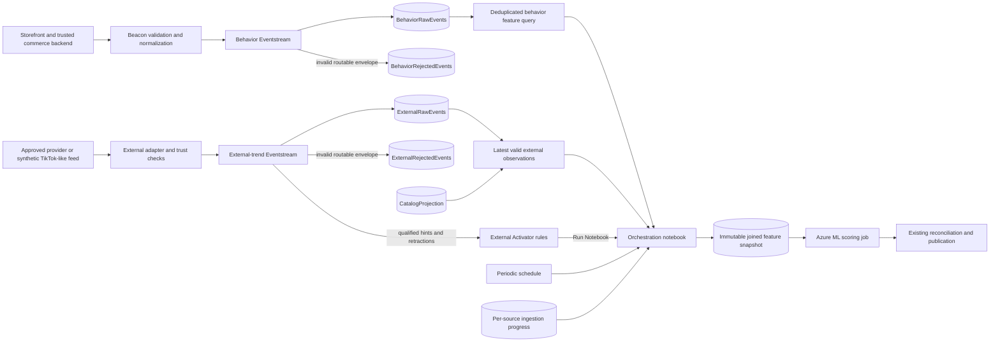

# Two-stream ingestion design

**Status:** Proposed engineering design  
**Reviewed:** 24 September 2026  
**Parent:** [Option C detailed design](option-c-hybrid-detailed-design.md)  
**Selected orchestration:** Activator Run Notebook -> Fabric notebook ->
Azure ML job -> validated publication. No Power Automate dependency.

## 1. Decision and boundaries

Create **two separate Fabric Eventstream items**, not two branches or sources
inside one item:

| Item template | Producer | Allowed business events | Primary destination |
|---|---|---|---|
| `es-behavior-{env}` | Trusted Beacon/backend adapter and synthetic behavior generator | `search`, `view_product`, `add_to_bag`, `remove_from_bag`, `purchase` | `BehaviorRawEvents` |
| `es-external-trends-{env}` | Approved external-trend adapter or synthetic trend generator | `external_trend` observations, revisions, and retractions | `ExternalRawEvents` |

Each has its own source endpoint, connection configuration, schema version,
deployment definition, monitoring, and pause/replay procedure. A source
credential for external trends must not grant access to the behavior endpoint.
Treat item names above as deployment conventions, not existing resources.

Share one Eventhouse/KQL database in the POC, with separate raw tables and
curation functions. Combine **features**, not unlike event counts, during
immutable snapshot preparation. Both paths ultimately produce one canonical
score per product through the existing notebook/ML lifecycle.

### Why not one mixed item?

- Behavior is high-volume, mostly repetitive, and potentially privacy-sensitive.
- External observations are lower-volume but bursty, revised, less trusted,
  and subject to provider licensing and quotas.
- External schema/provider changes can be deployed without editing behavior
  routing. Pause a broken external feed without deliberately stopping Beacon.
- Different owners can troubleshoot rejection, ingestion lag, and replay
  independently.

**Limits of separation:** two items in one workspace/capacity are not hard
compute or security isolation. Capacity exhaustion, Eventhouse failures, and
workspace-wide permissions can affect both. Use separate workspaces,
capacities, or databases if measured load or governance requires a stronger
boundary; then explicitly design cross-workspace feature access.

## 2. Topology



The diagram's curation nodes are explicit KQL/query or adapter responsibilities,
not built-in automatic Eventhouse-to-Activator connections. The external
Activator branch and Eventhouse branch deliver independently: an alert can
arrive before its underlying event is queryable.

Do not add an Eventstream Spark Notebook destination to implement this flow.
That is a different structured-streaming capability. The selected route is
the Activator **Run Notebook** action and the existing periodic schedule.

## 3. Source endpoints and acknowledgement

### POC connection

For each item, create a **Custom endpoint source** (called Custom App in some
capability/UI variants). Server-side producers use its documented Event
Hubs-compatible or Kafka protocol and supplied endpoint details. Prefer one
supported protocol consistently, initially Event Hubs-compatible AMQP.
Do not assume the endpoint is a generic HTTP POST webhook.

- Browsers call Beacon; they never receive Fabric endpoint credentials.
- Provider callbacks/polling terminate in the external adapter; providers do
  not send arbitrary payloads directly to Fabric.
- Prefer supported Entra authentication after validating tenant prerequisites,
  protocol, identity scope, and effective permissions for each endpoint.
- Where an approved endpoint credential is necessary, keep it in the approved
  secret store, separate by stream/environment, rotate it, and never export
  it with the Eventstream definition.
- If Fabric identity granularity cannot enforce the intended source boundary,
  treat that as a deployment blocker or use a supported upstream broker with
  scoped send rights. Payload fields are not authorization.

The POC need not provision separate Azure Event Hubs resources merely to use
Fabric Custom endpoints. Add an upstream broker only if its durability,
networking, or access-control requirements justify it.

### Delivery contract

1. Validate before sending; reject invalid/oversized input with a reason.
2. Reuse the same `eventId` and immutable payload on transport retry.
3. An ingestion API must not report durable acceptance until the send is
   acknowledged or the event is committed to a durable outbox.
4. Beacon returns an explicit retryable failure if neither succeeds. The
   synthetic generator can persist unsent batches locally for POC replay.
5. Production commerce events should use a backend outbox for business-critical
   purchases. If implemented, mark it delivered only after acknowledgement.
6. The external adapter persists its provider cursor/page/revision progress
   only after the corresponding normalized events are acknowledged or durably
   buffered. Honor provider rate limits and `Retry-After`.

A send acknowledgement is not Eventhouse visibility, feature readiness, or
exactly-once delivery. Fabric documents at-least-once delivery. Replays and
destination retries must be safe.

## 4. Common internal envelope

Retain the [internal event names](../research/06-event-schema.md) and public
[Beacon mapping](../api/README.md). Add explicit provenance to the normalized
envelope; this is not a change to the public Beacon contract:

| Field | Rule |
|---|---|
| `schemaVersion` | Version of this source family's schema; deployed readers explicitly support it |
| `eventId` | Unique per logical event/revision; stable on retry |
| `eventType` | Allow-list enforced by source family |
| `tenantId`, `collectionId` | Derived/authorized by server configuration, never trusted from arbitrary client text |
| `source` | Emitting application/adapter identity, not merely the social platform name |
| `sourceFamily` | Server-assigned `behavior` or `external`; verify against the physical source route |
| `eventTime` | Business occurrence time for behavior; observation time for external signals |
| `receivedAt` | UTC time the trusted ingress/adapter received the event |
| `correlationId` | Trace reference; no secrets or user identity |
| `payload` | Source-specific validated object |

Persist Eventhouse `ingestionTime` separately. Do not accept producer-supplied
ingestion timestamps as proof of freshness. Attach stream/item, mapping version,
and source connection lineage through controlled ingestion metadata.

Application limits start at **64 KiB serialized JSON per event**, with bounded
strings, arrays, and nesting; this is a design limit, not Fabric's service
limit. Reject oversized purchases rather than silently truncating their items.
Approve an explicit chunk/reassembly contract before allowing larger orders.

First-party future timestamps beyond five minutes are quarantined; start with
two minutes allowed lateness for online behavior windows. External old source
posts can be valid, but their *observations* must pass validity checks below.
All thresholds are tunable, versioned POC policy, not service guarantees.

## 5. First-party behavior stream

### Producer responsibilities

- Normalize client-facing Beacon names into the internal event names.
- Validate session/consent policy and minimize identifiers. Keep purchase
  authority explicit: only trusted order-backend confirmation contributes to
  purchase weighting; client-reported purchases are separately classified.
- Validate product IDs and retain catalog version/provenance for enrichment.
- Preserve query events without inventing per-product attribution.
- Rate-limit abusive sessions/producers before ingress. Internal origin alone
  does not prove bot-free or trustworthy activity.

Example normalized event:

```json
{
  "schemaVersion": "behavior-v1",
  "eventId": "behavior-000042",
  "eventType": "add_to_bag",
  "tenantId": "default",
  "collectionId": "catalog",
  "source": "beacon-adapter",
  "sourceFamily": "behavior",
  "eventTime": "2026-09-24T14:00:02.000Z",
  "receivedAt": "2026-09-24T14:00:02.100Z",
  "correlationId": "demo-behavior-42",
  "payload": {
    "productId": "SKU-10293",
    "quantity": 1,
    "price": 89.99
  }
}
```

### Item configuration and derived data

1. Land the normalized ingress envelope into `BehaviorRawEvents`, with explicit
   JSON ingestion mapping. "Raw" means privacy-minimized normalized input,
   not unrestricted browser payloads.
2. Use supported Filter/Manage Fields operations for lightweight checks and
   derived routing. Complex validation and catalog joins belong in adapters
   or explicit KQL functions, not an assumed built-in transform.
3. Route recognizable business-envelope failures to `BehaviorRejectedEvents`.
   Malformed transport JSON can fail before routing; capture it at ingress and
   monitor destination/parse errors. No automatic dead-letter queue is assumed.
4. Build a deduplicated query over raw records keyed by
   `(tenantId, collectionId, source, eventId)`. Conflicting content under the
   same key is rejected, not resolved by silently picking a convenient row.
5. Expand purchase items **after** event deduplication. Define POC counts as
   one occurrence per product per event; store units separately. Repeated
   product lines in one order must not multiply event counts.
6. Compute one-minute bins and rolling five-minute activity from the deduped
   input. Use comparable baseline intervals. Ingestion-only sum rollups over
   raw retries are not correct.
7. Keep `remove_from_bag` separate until its scoring semantics are approved.
   Query-only searches do not contribute to product activity.

The small POC can calculate exact distinct-event features on each snapshot.
At larger volume, use a tested deduplication/aggregation strategy with a
documented horizon; a short in-memory dedupe cache alone cannot protect a
longer replay.

**Activator:** no per-click or per-purchase notebook launches. Initially
behavior contributes through periodic snapshots. Later behavioral alerts
require an explicitly wired, validated aggregate feed and their own tests.

## 6. External-trend stream (TikTok-like example)

### Adapter, not a presumed TikTok connector

The POC emits synthetic observations. A future integration must use an
approved/licensed provider or permitted API with verified fields, access
rights, attribution, retention, and quotas. A TikTok URL is not authorization
to scrape it. No native TikTok Eventstream source is assumed.

The adapter converts provider-specific observations into product or compound
attribute signals. It owns provider authentication, polling/webhook
verification, checkpointing, rate limits, normalization, and provenance.
Do not fetch arbitrary `sourceUrl` values during scoring.

Example attribute observation (synthetic reference):

```json
{
  "schemaVersion": "external-v1",
  "eventId": "trend-blue-jackets-r3",
  "eventType": "external_trend",
  "tenantId": "default",
  "collectionId": "catalog",
  "source": "synthetic-trend-adapter",
  "sourceFamily": "external",
  "eventTime": "2026-09-24T14:00:00.000Z",
  "receivedAt": "2026-09-24T14:00:10.000Z",
  "correlationId": "demo-trend-blue",
  "payload": {
    "signalId": "blue-jackets-001",
    "revision": 3,
    "operation": "upsert",
    "signalType": "attribute",
    "attributes": { "colour": "blue", "category": "jackets" },
    "source": "tiktok",
    "sourceRef": "synthetic:video:001",
    "sourcePublishedAt": "2026-09-24T13:00:00.000Z",
    "observedAt": "2026-09-24T14:00:00.000Z",
    "validUntil": "2026-09-24T14:30:00.000Z",
    "confidence": 0.82,
    "magnitude": 0.60,
    "normalizationVersion": "synthetic-v1",
    "reason": "celebrity_mention"
  }
}
```

### Revision and trust semantics

- Key a logical signal by scope, adapter, and `signalId`. Each revision is a
  distinct event, but retries retain the same event ID/revision/content.
- Adapter-assigned revisions are monotonic for that signal. If the provider
  supplies no ordering token, the adapter maintains one durably.
- `operation` is `upsert` or `retract`. A retraction uses the same signal ID
  and a newer revision. It removes the contribution even if confidence or
  magnitude is absent. Do not filter it out using an upsert threshold.
- Select the latest revision known at the snapshot cutoff **before** checking
  eligibility, confidence, expiry, or retraction. A newer low-confidence,
  expired, or retracted observation must not expose an older strong revision.
- Preserve tombstones beyond the transport/replay horizon, or an old replay
  can resurrect a revoked trend. Do not physically delete revision history
  as the online revocation mechanism.
- `eventTime = observedAt`; `sourcePublishedAt` is separate. Polling an old
  observation again does not refresh its event time or validity.
- Validate `confidence` and `magnitude` as finite `[0,1]` numbers for upserts.
  Both product and attribute contributions apply confidence.
- Keep normalization versions/provider trust configurable and audited.
  Raw view counts from different providers are not comparable magnitudes.
- Public social posts, identities, media, and follower-level data are not
  required in the POC. Store minimal permitted references and structured
  features; retain raw provider payloads only under an approved policy.

### Item configuration and curation

1. Land accepted normalized observations in `ExternalRawEvents`.
2. Route known envelope failures to `ExternalRejectedEvents`; capture
   unparseable/provider failures in the adapter's restricted error store.
3. Derive current external observations using deduplication and latest-revision
   semantics, then resolve approved product IDs/attribute predicates against
   the versioned catalog.
4. Unknown/unresolved product or attribute mappings are retained with a reason
   for review but contribute nothing. Preserve `blue AND jackets`, never
   independent "blue" and "jackets" boosts.
5. External counts do not become views, bag additions, or purchases.
   Repeated cumulative provider snapshots are not summed. Initially take the
   maximum approved confidence-weighted, decayed contribution across matching
   signals rather than adding every duplicate mention.
6. Route qualifying upsert hints and all authorized retractions to an external
   Activator item. Hints reduce invocation volume but never replace notebook
   validation. Retractions may request recomputation below normal thresholds.
   Periodic recomputation also catches downgrades/expiry without an alert.

Project a bounded, flat Activator hint containing authorized scope,
`eventId`, `signalId`, `revision`, `operation`, observation time, and the
upsert threshold fields. Map these properties to notebook parameters;
retractions use a separate rule that does not require upsert-only fields.
The notebook always loads the authoritative observation from Eventhouse.

## 7. Shared snapshot readiness and notebook integration

Separate streams have no cross-stream ordering or atomic delivery guarantee.
An external alert can precede Eventhouse ingestion, or the streams can be at
different points in time.

Do not apply Eventstream Union to the two business schemas just to reduce
item count: the documented operation keeps matching-name/type fields and can
drop unmatched fields. Preserve separate raw contracts; join normalized
features explicitly.

### Readiness contract

Maintain ingestion progress by scope/source family and, where applicable,
producer partition/shard. Record a confirmed ingestion cutoff and health;
do not treat `max(eventTime)` as proof that every earlier event has arrived.
For the synthetic POC, producers emit known batches with stable IDs and a
manifest/count; snapshot preparation confirms all expected IDs are queryable.
Production needs tested source offsets/barriers or an explicitly bounded
lateness policy with measured incompleteness.

The immutable feature manifest adds:

| Field | Purpose |
|---|---|
| `snapshotCutoffUtc` | Freeze which ingested records/revisions are visible to this run |
| `behaviorWindowStart/End` | Event-time interval used for activity |
| `behaviorProgress`, `externalProgress` | Source/shard progress evidence or bounded-lateness policy version |
| `externalAsOfUtc` | Observation time boundary for latest-known trends |
| `inputSetVersion` | Hash of source cutoffs/revisions, schema versions, and catalog version |
| `sourceHealth` | Explicit healthy, idle, delayed, unavailable, or disabled status per source |
| `externalCoverage` | Whether external features were available, absent, or deliberately excluded |
| `triggerSignalId/revision` | When triggered externally, the expected observation to locate |

For a trigger, wait until that observation or a newer superseding revision is
queryable; re-evaluate its current eligibility. If not ready, persist
`WaitingForFeatures` and retry within the existing deadline. Do not fabricate
an external boost from the action parameters.

Choose one fixed behavior window and external as-of cutoff; join curated
features by scope/product against one catalog snapshot. Record separate
behavioral/external values and provenance, then execute the existing canonical
formula once. No join of arbitrary raw events across streams is needed.

### Idle and failed sources

- A healthy external feed with no observations is normal, not a blocking
  prerequisite. Adapter poll/heartbeat health distinguishes idle from failed.
  Heartbeats are control records, never behavioral activity or trend evidence.
- If external ingestion fails, continue with already known **unexpired**
  observations; do not extend validity. When none remain, use external `0`
  and record reduced coverage, keeping the configured weights unchanged.
- If required behavior input is delayed, wait within the run deadline. If the
  deadline expires, fail that run and retain previous serving state only
  until expiry. An external-only scoring policy requires a separate version
  and approval; do not silently reinterpret missing behavior as zero.
- An upstream outage does not mean a true activity count of zero.

When new external evidence arrives for an already scored behavior window,
allocate a correction revision and new `inputSetVersion`; do not deduplicate
it away under the earlier run key. Identical input sets coalesce. Newer source
windows outrank older ones; a late observation affecting current ranking must
enter a current-window recomputation, not overwrite it with an old-window job.
Both trigger families share the same concurrency limit and run ledger.

## 8. Operations, security, and replay

| Concern | Behavior | External |
|---|---|---|
| Owner | Commerce/Beacon team | Data integration/trend team |
| Main risks | Traffic spikes, bots, duplicate purchases, privacy | Provider outage, revision disorder, spoofed trends, licensing |
| Credentials | Beacon/backend sender only | Approved adapter sender only |
| Initial raw retention | Seven days of synthetic normalized data | Seven days of synthetic normalized observations |
| Rejection handling | Reason + redacted envelope/reference | Reason + minimal provider reference |
| Replay | Original event IDs/time; dedupe before counts | Original IDs/revisions; latest revision and tombstones win |
| Trigger mode | Periodic initially | Activator Run Notebook plus periodic convergence |

Retention above is a POC choice; production requires privacy/provider approval.
Configure Eventstream retention explicitly and inspect its limits in the
target capability. Retention is not a tested end-to-end recovery plan.
If a destination outage exceeds retained transport data, recover from a
durable producer/outbox archive or report the gap; never claim zero data loss
without that evidence.

Replay into isolated test destinations first. Production replay uses a
controlled run ID and original event IDs, throttling, and no mass notebook
activation. Suppress replay-driven Activator actions through a controlled
route/rule and reconcile periodically afterward; an untrusted payload flag
must not bypass validation or authorization.

Monitor each stream separately:

- accepted/acknowledged, queryable, rejected, and duplicate events;
- source-to-ingestion lag, event-time lateness, and destination errors;
- payload size/rate and source schema-version distribution;
- provider quota/poll health and external revision/retraction counts;
- unresolved catalog mappings, future/expired observations, and conflicts;
- notebook hints, coalesced invocations, readiness waits, and rejected runs;
- shared Fabric capacity and Eventhouse load to expose cross-item contention.

Do not promise that pausing one item or rotating one credential is harmless
until tested. Never reuse one privileged connection for both sources solely
for convenience.

## 9. Engineering rollout and acceptance

### Build sequence

1. Formalize/version the two envelopes and rejection reasons; add synthetic
   fixtures, including revisions and retractions.
2. Create two Eventstream items and distinct source connections.
3. Create separate raw/rejected tables and explicit ingestion mappings in the
   shared KQL database; export sanitized definitions per item.
4. Publish the behavior flow, prove deduplication and purchase expansion.
5. Publish the external flow, prove latest-revision handling, catalog mapping,
   and expiry before enabling alerts.
6. Add source-readiness manifests and deterministic joined feature snapshots.
7. Attach external Activator rules to validated hint/retraction routing and
   configure Run Notebook parameters. Keep behavior on periodic execution.
8. Exercise the existing ML/reconciliation/publication lifecycle, then test
   outages and replay independently for both sources.

### Required acceptance fixtures

| Scenario | Expected result |
|---|---|
| Behavior endpoint receives `external_trend` | Rejected/quarantined; no behavior count or job |
| External sender tries behavior connection | Denied by effective access controls; failure demonstrated in target tenant |
| Same purchase delivered three times | One event per product after dedupe, with units tracked separately |
| Query-only search event | No invented SKU activity |
| External revisions `3, 1, 3, 2` | Revision 3 once; no accumulated count boost |
| Revision 4 retracts revision 3 | No external contribution; replay of revision 3 does not revive it |
| Latest revision has lower confidence | Latest eligible state governs; older high score never resurfaces |
| Blue-jackets attribute observation | Only products satisfying the entire approved catalog predicate match |
| External alert precedes ingestion | Durable readiness wait, not immediate publication |
| Healthy external feed is idle | Periodic behavior jobs continue with explicit external coverage |
| External provider fails | Behavior continues; existing external values expire without renewal |
| Behavior feed fails | Required-input wait/failure, not fabricated zero activity |
| New external revision in an already scored window | New input-set/correction version; no lost update through coalescing |
| Attribute-wide activation burst | Bounded notebook/job admission; no per-SKU job fan-out |
| Pause external item while loading behavior | Behavior correctness and measured latency recorded; shared-capacity effects visible |
| Destination outage and replay | Recovery preserves IDs/revisions; ingestion gaps and unrecoverable ranges reported |

Unit/contract tests remain offline. Cloud identity, routing, latency, and
destination tests need explicit provisioning authorization. Report actual
event-to-rank timing; two items do not turn notebook/ML jobs into seconds-level
inference.

## 10. Research basis

Official Microsoft documentation reviewed for the design:

- [Eventstream overview: sources, destinations, at-least-once delivery and limits](https://learn.microsoft.com/fabric/real-time-intelligence/event-streams/overview)
- [Custom endpoint sources and authentication prerequisites](https://learn.microsoft.com/fabric/real-time-intelligence/event-streams/add-source-custom-app)
- [Eventhouse destination modes and ingestion mapping](https://learn.microsoft.com/fabric/real-time-intelligence/event-streams/add-destination-kql-database)
- [Supported transformations and content-based routing](https://learn.microsoft.com/fabric/real-time-intelligence/event-streams/route-events-based-on-content)
- [Activator Run Notebook action and parameter mapping](https://learn.microsoft.com/fabric/real-time-intelligence/data-activator/activator-tutorial#explore-a-rule)

These capabilities support the topology; the two-item split, schemas,
readiness policy, thresholds, and recovery procedures are application design
decisions. Validate current regional/capacity limits, permissions, retention,
and networking in the target tenant. No production TikTok API capability or
data entitlement has been assumed or verified.
