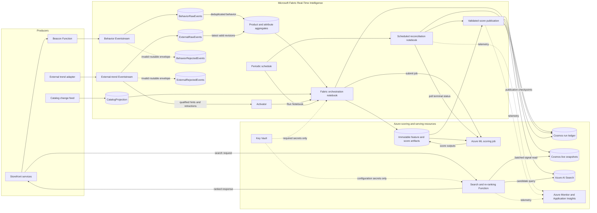
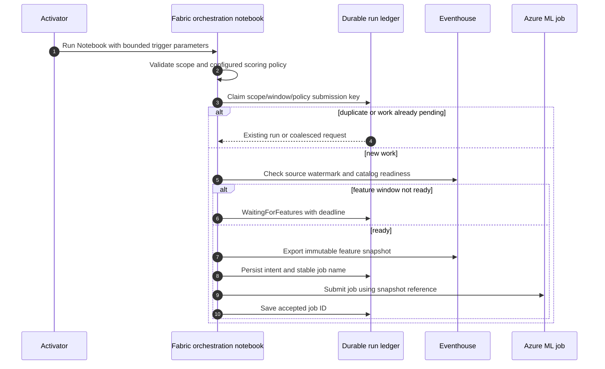

# Option C hybrid real-time search ranking: detailed design

**Status:** Proposed  
**Audience:** Search, platform, data, Fabric, SRE, security, and QA engineers  
**Last reviewed:** 24 September 2026  
**Source recommendation:** [Recommended architecture](../research/05-recommended-architecture.md)

**Selected revision:** Activator **Run Notebook** -> Fabric orchestration
notebook -> Azure ML command/pipeline job -> validated score publication.
This revision follows the [README](../../README.md#architecture), which takes
precedence over the original Power Automate/webhook proposal. No Power
Automate flow or HTTP signal-writer endpoint is required for this route.

**Ingestion topology:** two independent Eventstream items for first-party
behavior and external trends, sharing curated Eventhouse features and the
notebook/ML lifecycle. See the [two-stream ingestion design](eventstream-ingestion-design.md)
for source contracts, TikTok-like adapter boundaries, revisions, readiness,
failure isolation, and acceptance tests.

## 1. Purpose

This document turns Option C into an implementable design. Option C combines:

- an **index path** that periodically writes stable, rolling trend scores into
  Azure AI Search; and
- a **live-store serving path** that exposes completed score snapshots before
  Search indexing has necessarily propagated and applies a bounded
  not-yet-indexed score adjustment in a storefront re-ranking API.

Scheduled and event-triggered notebook runs share the same asynchronous job
lifecycle. A trigger starts work; it does not immediately update a score.
Notebook startup, snapshot preparation, ML queue/compute startup, execution,
reconciliation, and publication all contribute to freshness. This is not the
original seconds-level spike path.

Azure AI Search remains the authority for query relevance and candidate
selection. The trend system can reorder relevant candidates, but it must not
introduce a product that Search did not return or bypass filters, inventory,
entitlement, safety, or merchandising rules.

The first implementation should use:

- two Microsoft Fabric Eventstream items, a shared Eventhouse, and Activator
  for separated ingestion, feature aggregation, and qualified trend triggers;
- a Fabric orchestration notebook invoked by Activator or a periodic schedule;
- Azure ML command/pipeline jobs for reproducible score generation;
- durable run tracking and a publication step for validated job outputs;
- Azure Functions for Search/re-ranking and Beacon event capture;
- Azure Cosmos DB for NoSQL for live signal snapshots and separate run-ledger
  and publication-control containers; and
- Azure AI Search for candidate retrieval and the indexed trend baseline.

Prove the index-side MVP with the deterministic baseline first; it may publish
directly from Fabric before the Azure ML milestone. Then execute the same
baseline as a versioned job before considering a learned model. Container Apps
and Azure Managed Redis remain measurement-driven alternatives, not defaults.

## 2. Scope

### 2.1 In scope

- Aggregate, non-personalized product and attribute trend signals.
- First-party behavioral and simulated external trend events described in
  [the event schema](../research/06-event-schema.md).
- A bounded deterministic trend score in the range `[0, 100]`.
- Product-level and attribute-level boosts.
- Scheduled and Activator-triggered notebook orchestration, asynchronous
  scoring jobs, and publication to both serving destinations.
- Search candidate re-ranking, API contracts, security, reliability,
  observability, deployment, and test requirements.
- Explicit degraded serving when the live store or scoring pipeline is
  unavailable, with no successful empty responses for Search failures.

### 2.2 Out of scope

- Per-user personalization.
- Replacing BM25, vector search, hybrid search, or semantic ranking.
- Scraping social networks.
- An ML model on the online request path. The later forecasting option is
  covered by [Azure Machine Learning forecasting research](../research/08-azure-ml-forecasting.md).
- Seconds-level online inference. If required after measurement, separately
  design an Azure ML online endpoint and stream-processing writer; a notebook
  job is not an online endpoint.
- A global active-active production deployment in the POC. The design leaves
  room for it, but production region topology must follow the final SLO.

## 3. Design principles

1. **Relevance before momentum.** Trend is a bounded nudge over Search
   relevance, never an alternative retrieval engine.
2. **One canonical score.** Both paths transport the same score definition and
   scoring version.
3. **Apply only the delta.** The API compensates for live state not yet baked
   into the Search candidate; it does not apply the full trend score twice.
4. **Event time is authoritative.** Aggregation and decay use event time, with
   bounded handling for late events.
5. **At-least-once safe.** Producers, actions, and writers may retry. All
   writes are idempotent and ordered by version.
6. **Fail toward base relevance.** Missing or stale trend state removes the
   incremental boost; it must not fail the shopper query.
7. **No silent degradation.** Responses and telemetry expose the ranking mode,
   signal age, and reason for degradation.
8. **Separate history from serving state.** Eventhouse and immutable feature/
   score artifacts support replay; expiring live snapshots are reconstructable.
   The run ledger and publication checkpoints must not expire with snapshots.
9. **Version every behavioral contract.** Event schema, score formula, signal
   record, and ranking configuration versions are observable.

## 4. Decisions and alternatives

| Decision | Selected approach | Rationale |
|---|---|---|
| Ingestion | Separate behavior and external-trend Eventstream items | Independent contracts, credentials, routing, replay, and operational ownership; shared capacity is not hard isolation. |
| Runtime | Azure Functions for Search and Beacon; Fabric notebook for orchestration | Matches the README. A Function is not needed solely to launch an ML job. Select a supported hosting plan after latency/network testing. |
| Live store | Azure Cosmos DB for NoSQL | Per-product snapshots with explicit expiry, conditional writes, and bounded batch reads. Keep run tracking separate from expiring signals. |
| Source of record | Eventhouse history plus immutable feature/score artifacts | Supports replay, analytics, audit, and reconstruction. The durable run ledger records execution and publication state. |
| Attribute expansion | Resolve against a versioned catalog projection in Eventhouse | Makes output deterministic, avoids a fan-out Search query on the spike path, and records which catalog version produced membership. |
| Search update operation | `merge` for score-only updates | Never create incomplete products. Missing keys go to reconciliation; reserve `mergeOrUpload` for deliberate complete catalog upserts. |
| Ranking input | Search returns trend fields and stable product ID with candidates | The API needs the exact indexed score/version present on each candidate to compute a safe delta. |
| Paging | One page for the MVP; fixed snapshot and signed cursor if extended | Offset paging over independently re-ranked windows can duplicate or omit products. |
| Activator action | Native Run Notebook | Configure the Fabric notebook and its parameters directly in the rule; no Power Automate custom action or webhook adapter. Verify execution identity and permissions. |
| Score execution | Versioned Azure ML command/pipeline job | Both trigger types submit immutable inputs to the same scoring policy. Submission is not completion. |
| Publication | Absolute scores from successful, validated artifacts | Idempotent, version-ordered writes to Search and Cosmos DB; no raw trigger-to-score mutation. |

### 4.1 Deferred decisions

These values must be measured in the POC and promoted through configuration:

- Search candidate window size: start at `100`, test `50`, `100`, and `200`.
- Maximum live delta: start at `0.20` normalized relevance units, not a
  guaranteed percentage of Search's native boost.
- Live-state validity: start at `30 minutes` from the feature-window end,
  never from delayed job completion.
- Requested schedule/reconciliation interval: initially `60 seconds` only
  if supported and sustainable in the selected Fabric runtime; otherwise
  measure the supported interval and report the resulting latency.
- Allowed event lateness: start at `2 minutes`.
- Minimum evidence and spike thresholds.
- Production region count and recovery objectives.

## 5. Logical architecture



### 5.1 Component responsibilities

| Component | Owns | Must not own |
|---|---|---|
| Storefront event producer | Valid event envelope, stable IDs, consent-aware identifiers, UTC event time | Score calculation |
| Behavior Eventstream | First-party ingestion and routing to behavior raw/rejected tables | External observations or per-click notebook launches |
| External-trend Eventstream | Approved adapter observations, raw/rejected routing, qualified Activator hints/retractions | Scraping TikTok, trusting arbitrary provider scores, or writing serving state |
| Eventhouse | Raw history, rejected rows, aggregates/features, catalog projection, deterministic MVP calculation, replay | Online request serving |
| Activator | Detecting qualifying events and running the configured Fabric notebook | ML completion tracking or score publication |
| Orchestration notebook | Parameter validation, trigger coalescing, immutable feature snapshot, persisted submission intent, job submission | Long-lived polling or serving shopper requests |
| Azure ML job | Versioned scoring code/model, pinned environment, immutable output artifact | Direct writes to Search or live snapshots |
| Reconciliation notebook | Recovering submissions and tracking terminal status; invoking publication after validation | Assuming submission means completion |
| Publication step | Ordered, idempotent Search/Cosmos writes and per-destination checkpoints | Recomputing scores on retry |
| Cosmos DB | Separate live-snapshot, run-ledger, and publication-control containers | Replacing raw history or immutable artifacts |
| Azure AI Search | Candidate retrieval, filters, text/vector/semantic relevance, indexed baseline boost | Sub-minute state storage |
| Re-ranking API | Query validation, Search call, bounded Cosmos batch reads, delta blend, optional snapshot paging | Running notebooks or ML inference during a request |

## 6. End-to-end flows

### 6.1 Scheduled scoring and publication

```mermaid
sequenceDiagram
    autonumber
    participant N as Fabric orchestration notebook
    participant F as Eventhouse and artifact storage
    participant L as Durable run ledger
    participant J as Azure ML job
    participant P as Reconciliation and publication
    participant C as Cosmos live snapshots
    participant S as Azure AI Search

    N->>L: Claim submission key and persist intent
    N->>F: Read ready window and persist immutable features
    N->>J: Submit named job with snapshot reference
    J-->>N: Job ID (accepted, not completed)
    N->>L: Record job ID and submitted state
    J->>F: Write immutable score outputs
    P->>L: Read pending runs
    P->>J: Get job status and output reference
    J-->>P: Terminal success or failure
    P->>P: Validate only successful artifacts
    P->>C: Conditional write if source version is newer
    P->>S: Batch merge trend fields
    S-->>P: Per-document status
    P->>P: Retry transient failures; dead-letter permanent failures
    P->>L: Persist per-destination outcomes and checkpoint
```

Reconciliation is a separately scheduled Fabric notebook using shared
publication code; it resumes unfinished runs after the submitting notebook
exits. It processes a bounded batch and returns, rather than waiting for all
jobs to complete. Record its actual schedule and startup overhead.

The feature selector includes changed products **and previously boosted
products needing decay/reset**. Track a durable source watermark and overlap
by the allowed lateness. A time-only `ago(...)` hot-set query loses changes
during an outage. Publication tracks each artifact, product, version, and
destination; only durable applied/superseded/dead-letter outcomes allow a
checkpoint to advance. Dead letters require explicit reconciliation.

The Search batch uses at most the documented service request limit and a lower
configurable operational cap. Start with `500` documents per request and
reduce it when payload size approaches the API limit. Handle each document's
result independently; an HTTP-successful batch can still contain failed
actions.

### 6.2 Activator-triggered notebook path



After submission, this path joins the same reconciliation/publication flow
as Section 6.1. There is no direct Activator-to-live-store mutation.

Configure the rule action as **Run Fabric activities -> Run Notebook**,
select the version-controlled Fabric notebook, and add its parameters.
Microsoft documents passing alert properties using `@PropertyName` in the
action configuration. Test the mapping and execution permissions in the
target workspace; pipeline notebook identity behavior must not be assumed
to apply automatically to Activator-triggered runs.

Start with qualifying synthetic `external_trend` hints and authorized
retractions routed from the **external-trend Eventstream** to Activator.
The behavior item initially feeds periodic snapshots only. A behavioral-window rule needs an explicitly
configured aggregate feed; an Eventhouse table does not automatically feed a
rule. Activator receives evidence and identifiers, not an arbitrary job
definition, credentials, storage URL, or score that it can publish directly.
Because the Activator and Eventhouse branches deliver independently, wait for
the trigger revision or a newer superseding revision to become queryable.
Use the [per-source readiness contract](eventstream-ingestion-design.md#7-shared-snapshot-readiness-and-notebook-integration),
not a single maximum timestamp across both streams.

For an attribute signal, Eventhouse first expands the signal against
`CatalogProjection` during feature preparation. Preserve the entire predicate
(`colour=blue AND category=jackets`). Bound the product count per snapshot and
split large expansions into tracked chunks, not one notebook invocation per
product. Coalesce activations by tenant/collection, feature window, and
scoring policy so a category-wide spike cannot launch unbounded ML jobs.

### 6.3 Shopper query path

```mermaid
sequenceDiagram
    autonumber
    participant C as Storefront
    participant API as Re-ranking API
    participant S as Azure AI Search
    participant L as Cosmos live snapshots

    C->>API: POST /v1/search
    API->>API: Validate and normalize request
    API->>S: Text query + filters + scoring profile; top N
    S-->>API: Candidates with indexed trend state
    API->>L: Bounded batch point reads by ID and partition key
    L-->>API: Live signal records
    API->>API: Validate age/version; calculate bounded delta; stable sort
    API-->>C: Page + ranking diagnostics
```

Use the selected Cosmos SDK's read-many support where available, otherwise
bounded-concurrency point reads with a shared deadline. This is one logical
batch, not a guarantee of one network request across partitions. Record RU
consumption, throttling, and latency. No notebook or Azure ML job is called on
the shopper request path.

### 6.4 Durable job lifecycle and ordering

The ledger contains: `submissionKey`, authorized scope, trigger IDs,
`featureWindowEnd`, snapshot ID/hash/URI, schema/catalog/scoring versions,
stable job name and Azure ML job ID, attempt, execution identity reference,
timestamps, deadline, output reference/hash, errors, and per-destination
publication progress. These are application states, not Azure ML status names:

Derive `submissionKey` from a canonical encoding of tenant, collection,
feature-window end, correction revision, and scoring policy version. Keep
activation IDs as evidence, not as the sole deduplication key: scheduled and
event-triggered requests for the same snapshot should join the same run.
The snapshot's `inputSetVersion` records both source cutoffs/revisions. New
external evidence in the same behavior window allocates a correction revision;
identical input sets coalesce, but genuinely new input must not be discarded.

```text
Requested -> WaitingForFeatures -> Submitting -> Submitted -> Running
          -> Succeeded -> Validating -> Publishing -> Published
Terminal alternatives: Failed, Cancelled, TimedOut, Rejected, Superseded
```

- Claim each submission key using conditional create; concurrent duplicate
  activations join the existing record. Store intent **before** submission.
- Use a stable job name per submission attempt. If the submission response is
  lost, reconcile that name with Azure ML before creating another job. Do not
  assume `create_or_update` itself supplies the application's exactly-once
  guarantee.
- Periodically reconcile pending records, including `WaitingForFeatures`.
  Normalize SDK terminal states explicitly. Unknown states are logged and
  retried within the run deadline, never treated as success.
- On timeout, request cancellation if supported, mark the attempt ineligible
  for publication, and reconcile its final state. A late successful artifact
  from a timed-out/cancelled attempt must not publish.
- Only successful jobs with complete, valid, unexpired artifacts publish.
  Reject duplicate product keys, mismatched scope/window/policy, non-finite
  scores, unknown products, and bad hashes. Retain rejected artifacts for
  investigation under the approved retention policy.
- Assign state order from the feature window and controlled correction
  revision, not the completion timestamp. An older window finishing later
  must not overwrite newer live or indexed state.
- Retry destination writes from the persisted artifact without rerunning the
  scoring job. Search and Cosmos are not a distributed transaction.
- Serialize Search writes per product/partition, with one active publisher
  owner and no overlapping notebook publishers. Re-read the latest desired
  state before retrying; Search document merges do not provide a per-document
  version compare-and-set. After an ambiguous timeout, reconcile and reapply
  the latest desired state rather than blindly retrying an old payload.

Use Cosmos containers for the durable run ledger and publication control
(separate from expiring live snapshots). Claim ownership with ETags and
bounded leases; a publisher that loses ownership must stop issuing writes.
The POC uses one publication owner; scaling it requires disjoint product
partitions, failure/takeover tests, and latest-state repair.

## 7. Data contracts

### 7.1 Inbound event envelope

The existing event shape remains the logical contract, with these required
production additions:

```json
{
  "schemaVersion": "behavior-v1",
  "eventId": "b2f0c1f0-0000-4000-8000-000000000000",
  "eventType": "view_product",
  "eventTime": "2026-09-24T13:00:00.000Z",
  "receivedAt": "2026-09-24T13:00:00.420Z",
  "source": "storefront-web",
  "sourceFamily": "behavior",
  "tenantId": "default",
  "collectionId": "catalog",
  "correlationId": "01J...",
  "sessionId": "s_9f2e",
  "userId": null,
  "payload": {
    "productId": "SKU-10293",
    "category": "jackets",
    "colour": "blue"
  }
}
```

Validation rules:

- `eventId` is globally unique and immutable.
- `eventTime` is UTC ISO 8601 and cannot be more than five minutes in the
  future.
- `source`, `eventType`, and `schemaVersion` are allow-listed.
- Unknown top-level fields are retained in raw storage but ignored by the
  current parser.
- Invalid events are written to `RejectedEvents` with a reason code and a
  redacted payload. They are not silently dropped.
- `userId` is unnecessary for aggregate ranking and should be omitted or
  pseudonymized before Fabric.

### 7.2 Canonical product signal

All publishers use this logical record:

```json
{
  "schemaVersion": "1.0",
  "tenantId": "default",
  "collectionId": "catalog",
  "productId": "SKU-10293",
  "score": 78.4,
  "scoreVersion": "deterministic-v1",
  "stateVersion": "20260924130000000-0000",
  "featureWindowEnd": "2026-09-24T13:00:00.000Z",
  "snapshotId": "features-default-20260924-1300-r0",
  "runId": "score-default-20260924-1300-r0",
  "computedAt": "2026-09-24T13:04:00.123Z",
  "validUntil": "2026-09-24T13:30:00.000Z",
  "reasonCodes": [
    "VIEW_VELOCITY",
    "EXTERNAL_PRODUCT_TREND"
  ],
  "sourceEventTimeMax": "2026-09-24T12:59:58.900Z",
  "catalogVersion": "catalog-20260924-1255",
  "correlationId": "01J..."
}
```

Requirements:

- `score` is finite and in `[0, 100]`.
- `stateVersion` is a fixed-width ordinal string:
  `yyyyMMddHHmmssfff-rrrr`, where the UTC prefix is the feature-window end and
  `rrrr` is a ledger-allocated correction revision (`0000..9999`). Never wrap
  the revision; fail explicitly if exhausted. Compare ordinally within one
  authorized scope and active scoring policy. Retries retain the same version.
- `featureWindowEnd` governs input freshness; `computedAt` describes actual
  job calculation time, not action delivery time or ordering priority.
- `snapshotId` and `runId` link the result to its immutable inputs and ledger.
- `validUntil` is computed from the source window and signal policy, not job
  completion. Reject already-expired artifacts instead of extending their
  lifetime on publication. Live-store TTL is cleanup, not serving validity.
- `reasonCodes` use a controlled vocabulary and contain no customer or social
  post text.
- A score-formula change creates a new `scoreVersion`; mixed versions are not
  blended. A learned policy additionally records an immutable model asset
  version. Activate a policy through a controlled configuration rollout, not
  whichever job finishes last.

### 7.3 Eventhouse tables

#### Separate raw tables and shared analytical shape

Use physical `BehaviorRawEvents` and `ExternalRawEvents` tables with separate
JSON mappings, plus `BehaviorRejectedEvents` and `ExternalRejectedEvents`.
An optional `RawEvents` query/function can project the common columns below
for diagnostics; it is not a third ingestion sink and must not double-count
the underlying rows. `RejectedEvents` can similarly be an analytical union.
Malformed input rejected before stream parsing is captured at ingress, not
assumed to reach an automatic stream dead-letter destination.

| Column | Type | Notes |
|---|---|---|
| `eventId` | string | Deduplication key |
| `schemaVersion` | string | Parser selection |
| `eventType` | string | Allow-listed event type |
| `eventTime` | datetime | Windowing time |
| `receivedAt` | datetime | Trusted ingress/adapter receipt |
| `ingestionTime` | datetime | Operational latency |
| `source` | string | Producer identity |
| `sourceFamily` | string | Verified behavior/external route |
| `tenantId` | string | Partition/security boundary |
| `collectionId` | string | Authorized catalog scope |
| `correlationId` | string | Trace correlation |
| `productId` | string | Extracted where present |
| `payload` | dynamic | Original allowed payload |

Retain raw data according to privacy and replay requirements. The POC should
use at least seven days; production retention requires data governance
approval.

#### `CatalogProjection`

| Column | Type | Notes |
|---|---|---|
| `tenantId`, `collectionId`, `productId` | string | Composite logical key |
| `category`, `colour`, `brand` | string | Normalized filterable dimensions |
| `tags` | dynamic | Controlled normalized tags |
| `isSearchable`, `isInStock` | bool | Eligibility guard |
| `catalogVersion` | string | Snapshot/change-feed version |
| `effectiveFrom`, `effectiveTo` | datetime | Temporal membership |

Attribute expansion uses the catalog version effective at signal computation
time. Inactive or out-of-stock products are excluded before publication, but
the storefront's current Search filters remain the final authority.

#### Derived tables

- `ProductSignals1Min`: product/event-time tumbling window counts.
  Deduplicate behavior before aggregation and purchase-item expansion.
- `ProductBaseline1Hour`: comparable trailing baseline excluding the current
  short window.
- `ExternalLatestObservations`: latest known revision per scoped signal,
  followed by retraction/expiry/eligibility evaluation.
- `AttributeTrend5Min`: compound attribute predicate and category scope;
  derived from eligible external observations, not independent tag counts.
- `ProductTrendingScore`: latest canonical record and evidence; after the ML
  milestone, populated from validated artifacts for analytics. Do not assume
  an ingestion-only materialized view performs clock-driven decay or ML work.
- `SignalPublicationLog`: destination, state version, attempt, status, error
  class, and timestamps.
- `RejectedEvents`: diagnostic union over the two rejection tables.

### 7.4 Cosmos DB serving and control model

Use a `LiveSignals` container partitioned by `/productKey`, a server-generated
encoding of tenant, collection, and product ID. Do not concatenate unescaped
caller strings. Store one current snapshot (`id = "current"`) per partition,
containing the canonical record plus `productKey`, `_etag`, and positive
item-level `ttl` seconds.

Conditional write algorithm:

1. Verify the artifact, active scoring policy, and unexpired `validUntil`.
2. Read the current snapshot by ID/partition key.
3. Older version: return `superseded`. Equal version and identical canonical
   content: return `duplicate`, without refreshing expiry.
4. Equal version with different content: reject as a contract violation.
5. Newer version: replace using `If-Match` with the read ETag. On `412`,
   re-read and compare again within a bounded retry budget.
6. If absent, create rather than unconditional upsert. On a creation conflict,
   re-read and compare. Also check the durable publication high-water mark:
   expiration of a live item must not allow an old job to resurrect it.

Enable container TTL with per-item values. Cosmos TTL is relative to last
modification, so derive the remaining lifetime from `validUntil` at each
write; do not reset a full 30-minute lifetime on retries. The API must always
check `validUntil` independently of physical deletion and tolerate clock skew
conservatively.

Use separate `ScoringRuns` and `PublicationState` containers for submission
deduplication, leases, high-water marks, and retry outcomes. Do not give these
records the short live-signal TTL. Retention must exceed the maximum job,
retry, and replay horizon. Rehydrate only the latest valid approved snapshots
from immutable artifacts and publication state after loss.

### 7.5 Azure AI Search index additions

| Field | Type | Attributes | Purpose |
|---|---|---|---|
| `productId` | `Edm.String` | key/filterable/retrievable | Stable join key |
| `trendingScore` | `Edm.Double` | filterable/retrievable | Indexed canonical score |
| `lastTrendingAt` | `Edm.DateTimeOffset` | filterable/retrievable | Freshness and diagnostics |
| `trendingTags` | `Collection(Edm.String)` | searchable/filterable/retrievable | Optional tag boost |
| `trendStateVersion` | `Edm.String` | retrievable | Fixed-width source-window/revision ordering |
| `trendScoreVersion` | `Edm.String` | retrievable/filterable | Compatibility guard |
| `trendFeatureWindowEnd` | `Edm.DateTimeOffset` | retrievable | Source freshness |
| `trendValidUntil` | `Edm.DateTimeOffset` | retrievable | Explicit validity diagnostics |

Write all trend fields for a product in the same merge. `lastTrendingAt`
reflects qualifying source activity, not a delayed job completion or retry.
Index version fields enable comparison and repair; they do not make Search
reject older document writes. Section 6.4 defines publication ordering.

The index publisher uses `merge`. A `404`/missing product is not retried
indefinitely: write it to reconciliation, verify catalog publication order,
and update the score only after the full product exists.

## 8. Score calculation

### 8.1 Deterministic score

For product `p` at time `t`:

In the MVP evaluate the deterministic formula against a fixed feature window.
In the ML milestone package the same calculation into a versioned command
component with pinned dependencies; use shared golden fixtures to prove
equivalence before changing the formula or introducing a learned model.

```text
weightedActivity =
    1 * viewVelocity
  + 2 * addToBagVelocity
  + 3 * purchaseVelocity

behavioral = robustNormalize(
  weightedActivity relative to a comparable trailing baseline
)

external = max(
  productExternalMagnitude * productExternalConfidence,
  matchingAttributeMagnitude * matchingAttributeConfidence
)

raw = 0.5 * behavioral + 0.5 * external
score = round(clamp(100 * raw, 0, 100), 2)
```

`robustNormalize` must be specified in code/KQL and test fixtures. For sparse
POC traffic, use a smoothed ratio rather than an unstable z-score:

```text
ratio = (recentWeightedActivity + epsilon)
      / (expectedWeightedActivity + epsilon)

behavioral = clamp(log2(ratio) / spikeRatioAtMax, 0, 1)
```

Starting values:

- `epsilon = 1`
- `spikeRatioAtMax = log2(8) = 3`
- minimum recent evidence before a behavioral boost: `5` weighted events

This maps baseline-or-lower activity to zero and an eight-times spike to one.
Use traffic-segment baselines by category and time-of-week if product history
is too sparse.

Do not subtract `remove_from_bag` by default. Preserve it as an event and
define/test its semantics separately before enabling a negative contribution;
negative activity must never reach the logarithm. Use nonnegative,
same-duration recent/expected activity windows and the approved event-versus-
quantity convention.

### 8.2 Decay

Scores must decay even when no new event arrives. Calculate:

```text
decayedComponent(age, halfLife) =
  componentAtDetection * 2 ^ (-age / halfLife)
```

Starting half-lives:

- behavioral spike: 10 minutes;
- product external trend: 20 minutes;
- attribute external trend: 30 minutes.

The periodic job recomputes active records at each new feature window until
they round to zero. Live-store expiry is a final safety mechanism, not the primary
decay implementation. When a score becomes zero, publish a zero to Search;
otherwise an old indexed score can remain boosted after the live snapshot
expires. Keep zero/reset records in the durable publication backlog until
Search acknowledges them and visibility is checked. TTL alone never resets
Search fields.

If scoring is stopped, indexed magnitude boosts may remain until repair.
Alert on stale publication and use a configured baseline mode without the
trend scoring profile when freshness is unacceptable; do not claim live-store
expiry reverses the indexed boost. Recovery must publish expired-product resets
before declaring freshness restored.

### 8.3 Spike qualification

Activator requests work; it does not fast-publish a canonical score.

- External rules also route authorized retractions for recomputation without
  applying the upsert confidence/magnitude thresholds. The notebook rechecks
  latest revision, expiry, and catalog eligibility before using any signal.
- Initially trigger on approved synthetic `external_trend` events with
  confidence at least `0.8` and magnitude at least `0.6`.
- For behavioral triggers, first build and wire an aggregate feed containing
  recent weighted activity, comparable baseline, source watermark, and scope.
  A starting rule is at least five weighted events and a recent/baseline
  ratio above three; calibrate from the seeded traffic.
- Eligibility and attribute membership are validated in feature preparation.
- Apply a scope-level cooldown, initially five minutes for the job experiment,
  and at most one active scoring run per scope. Persist/coalesce subsequent
  requests to the newest ready window instead of discarding them.
- Periodic runs still process ordinary activity, decay, and resets when no
  trigger fires.

Cooldown, concurrency, and schedule settings must fit observed job duration,
Fabric capacity, and Azure ML quota. They replace the original 30-second
webhook suppression assumption.

## 9. Search and re-ranking algorithm

### 9.1 Candidate request

The API sends the storefront's query and authorized filters to Azure AI
Search. The request:

- selects the fields needed by the client and all indexed trend fields;
- applies the configured scoring profile;
- starts with keyword search; vector/hybrid/semantic modes are optional and
  require separate candidate-limit and relevance validation;
- requests `candidateWindow`, initially `100`;
- requests a stable tie-break field (`productId`);
- does not use Search `$skip` for shopper paging through the re-ranked set.

Semantic ranker operates on only its eligible top candidates. The trend
re-ranker therefore cannot rescue a semantically irrelevant product outside
the Search candidate window; this is intentional.

### 9.2 Normalize Search relevance

Search score ranges differ between BM25, vector, hybrid RRF, and semantic
queries. Do not combine the raw score directly with a `[0,100]` trend score.
Normalize within the candidate set using rank:

```text
relevance(p) = 1 - (rank(p) - 1) / max(candidateCount - 1, 1)
```

This produces `[0,1]`, preserves Search ordering, and is stable across Search
score families. A later calibrated score transform can replace it only after
offline evaluation.

### 9.3 Delta-only live signal

For each candidate:

```text
indexed = valid indexed score, else 0
live    = valid live score, else indexed

if live.scoreVersion != indexed.scoreVersion:
    live = indexed

if live.stateVersion <= indexed.stateVersion:
    live = indexed

delta = clamp((live.score - indexed.score) / 100, -1, 1)
```

A negative delta is important: a newer decayed live score can reduce the
incremental ranking adjustment before the next visible Search update.
This rank-based heuristic is not an algebraic inverse of Search's native
scoring profile. If live state is missing, expired, or unavailable, delta is
zero. Treat invalid/missing indexed version metadata as incompatible rather
than guessing what was indexed, and record the reason.

### 9.4 Final score

Start with:

```text
boundedDelta = clamp(delta, -0.20, 0.20)
finalScore = relevance + boundedDelta
```

Then sort by:

1. `finalScore` descending;
2. original Search rank ascending; and
3. `productId` ascending.

The `0.20` cap means live state can move a candidate materially but cannot
overwhelm the full relevance range. The indexed scoring profile must also be
configured modestly and evaluated separately. Do not assume its numeric boost
equals the API's normalized contribution.

Guardrails:

- Never modify the membership of the Search candidate set.
- Never remove or alter security, catalog, inventory, price, locale, or
  compliance filters.
- Do not boost a result below a configurable relevance floor, initially the
  bottom `25%` of candidates.
- Limit maximum rank movement, initially `20` positions, unless an approved
  merchandising policy explicitly overrides it.
- Record the pre-rank, post-rank, indexed score, live score, delta, and reason
  code in sampled diagnostics.

### 9.5 Paging

Re-ranking a new Search window for every page is not stable. Start with one
result page as specified in the README. If multi-page delivery is requested:

1. Fetch and rank one candidate window.
2. Return the first page and an opaque, signed cursor.
3. Cursor state contains or references:
   - query/filter hash;
   - ranking configuration version;
   - ordered product IDs or a server-side result-set ID;
   - next offset; and
   - expiry, initially five minutes.
4. Subsequent pages use the same ordering snapshot.

For small windows, an encrypted/signed cursor can contain compressed IDs. For
larger payloads, use a separate short-lived result-set item in Cosmos DB.
Bind the cursor to caller scope, query, and filters; recheck current product
eligibility before returning each page. Never expose unsigned ranking state
or trust client-supplied product IDs. Define expired/lost snapshot responses
before enabling this extension.

## 10. API design

The [Search and Beacon API review](../api/README.md) and its OpenAPI drafts
remain the public contract starting point. The examples below describe the
internal ranking adapter, not a replacement provider-compatible wire format.
Notebook orchestration is internal and does not change Beacon event capture.

### 10.1 Storefront search

```http
POST /v1/search
Authorization: Bearer <storefront-service-token>
Content-Type: application/json
X-Correlation-ID: 01J...
```

```json
{
  "query": "blue jacket",
  "filters": {
    "category": ["jackets"],
    "colour": ["blue"],
    "inStock": true
  },
  "pageSize": 24,
  "cursor": null,
  "locale": "en-GB",
  "rankingMode": "hybrid-trend-v1"
}
```

Response:

```json
{
  "results": [
    {
      "productId": "SKU-10293",
      "title": "Blue jacket",
      "rank": 1,
      "ranking": {
        "mode": "hybrid",
        "reasonCodes": ["EXTERNAL_PRODUCT_TREND"]
      }
    }
  ],
  "nextCursor": "opaque-signed-value",
  "diagnostics": {
    "correlationId": "01J...",
    "rankingModeApplied": "hybrid",
    "rankingConfigVersion": "hybrid-trend-v1",
    "signalAgeMaxMs": 240000,
    "degradedReasons": []
  }
}
```

Production responses may omit per-result ranking details, but internal/demo
clients need them. Never expose raw external source references, user IDs, or
commercially sensitive weights to public clients.

Validation:

- `query` has repository-standard length and character limits;
- `pageSize` is `1..50`;
- filter names and values map through an allow-list, never raw OData text;
- `rankingMode` is server-authorized, not an unrestricted client toggle; and
- cursor query/filter hash must match the current request.

Errors:

| Status | Condition |
|---|---|
| `400` | Invalid query, filter, page size, or cursor |
| `401/403` | Missing identity or unauthorized caller |
| `429` | API admission control |
| `502` | Azure AI Search unavailable and no permitted fallback result exists |
| `504` | Search exceeded the end-to-end deadline |

Live-store failure does **not** return an error if Search succeeds. Return Search's
indexed order with `rankingModeApplied: "indexed-only"` and emit an error
metric.

### 10.2 Notebook invocation and job artifact contracts

There is no `/internal/v1/signals` HTTP endpoint in the selected architecture.
Define and validate this logical parameter contract in the Fabric notebook's
parameter cell; map Activator properties using **Add parameter**:

| Parameter | Source and validation |
|---|---|
| `triggerMode` | Configured `event` or `scheduled`; never arbitrary code |
| `tenantId`, `collectionId` | Authorized scope from controlled configuration/rule |
| `triggerEventId`, `ruleId` | Event/rule references for correlation and deduplication; optional for scheduled runs |
| `triggerSignalId`, `triggerRevision`, `triggerOperation` | External observation/retraction hints; validate by loading the current Eventhouse revision |
| `requestedWindowEndUtc` | UTC window hint; notebook checks the actual ingestion watermark and lateness policy |
| `correlationId` | Validated trace identifier; generated if absent for a schedule |

Scoring policy, notebook ID, Azure ML workspace/compute, storage endpoints,
identity, and resource limits come from deployment configuration, not alert
payloads. The notebook resolves the controlled catalog and feature snapshot;
never pass large SKU lists, raw event data, credentials, or executable code as
action parameters.

The immutable **feature manifest** includes snapshot ID/URI/hash, source-family
schema versions, tenant/collection, per-source progress and health, snapshot
cutoff, behavior window, external as-of time, `inputSetVersion`, catalog
version, product count, and scoring policy. The job reads this manifest and writes a **score
manifest** with the input hash, run ID, code/environment/model versions, output
URI/hash, row count, calculation time, and validity bounds. Outputs contain
canonical records from Section 7.2 and explicitly include required zero resets.

Only the reconciler validates and passes artifacts to the shared publisher.
Publication records per-product outcomes (`applied`, `duplicate`,
`superseded`, `retryable`, `rejected`) for Search and Cosmos separately. Invalid
parameters/artifacts fail the run with a reason code; dependency failures
remain retryable within a bounded deadline. Nothing is acknowledged as
published merely because a notebook or Azure ML submission succeeded.

### 10.3 Health endpoints

- `/health/live`: process is running; no dependency calls.
- `/health/ready`: configuration loaded and Search/live-store clients initialized.
  Use shallow, rate-limited dependency checks.
- `/health/startup`: migrations/configuration validation complete.

Health responses must not expose endpoints, keys, tokens, index names, or
exception details.

## 11. Security design

### 11.1 Identity and authorization

- Use managed identities from Functions to Search, Cosmos DB, Key Vault, and
  monitoring where supported. Use Cosmos data-plane RBAC, not merely Azure
  control-plane Contributor.
- Grant the re-ranking API only Search query and live-snapshot read access.
- Grant the publisher Search document indexing and the required Cosmos
  snapshot/control-container permissions.
- Verify the actual security context of Activator-triggered and scheduled
  notebook execution separately. Use a supported noninteractive Entra
  credential flow; do not assume workspace identity automatically applies to
  every notebook trigger. Block unattended rollout until both paths work.
- The notebook identity can read features, write snapshots/run records, and
  submit/read Azure ML jobs in the selected workspace. The job identity can
  read its immutable inputs and write outputs, not update serving stores.
- The reconciler can read job status/artifacts and invoke the publisher.
  Separate API, orchestration, scoring, publication, and deployment privileges
  even if orchestration/reconciliation share notebook code.
- Authenticate storefront service-to-service calls with Microsoft Entra ID or
  the organization's approved gateway identity.
- Restrict who can edit Activator rules, notebook code/parameters, registered
  scoring components, and active policy configuration. There is no public
  workflow-to-writer callback to authenticate in this design.

### 11.2 Network

- Select Functions hosting/network options that support the required VNet
  integration and ingress controls.
- Use private endpoints/private DNS for Search, Cosmos DB, artifact storage,
  and Key Vault where supported by the selected tiers.
- Disable public network access after deployment and break-glass validation.
- Expose the shopper API through the approved ingress/gateway/WAF path.
- Validate Fabric notebook egress and Azure ML compute access to private
  artifact storage, job control APIs, Search, Cosmos DB, and Key Vault before
  disabling their public access. Network support and identities are distinct
  prerequisites; an Entra token does not provide private network reachability.
- Do not create a public signal-writer endpoint to work around failed
  notebook connectivity.

### 11.3 Data protection

- TLS is required for every hop.
- Trend state contains product operational data only; do not write session,
  user, order, raw social content, or access tokens to live snapshots or job
  manifests.
- Use Key Vault only for dependencies that cannot use managed identity.
- Redact request headers, query text where policy requires, and payloads from
  application logs.
- Define retention and deletion for raw behavioral events with privacy owners.

### 11.4 Threat controls

| Threat | Control |
|---|---|
| Unauthorized notebook/job execution | Controlled Fabric item permissions, validated rule parameters, least-privilege job submission identity |
| Replay or job storm | Durable submission key, coalescing, cooldown, per-scope concurrency and quotas |
| Output artifact substitution | Allow-listed storage, immutable input/output references and hashes, job/scope/window/policy validation |
| Score poisoning | Producer allow-list, schema/range validation, evidence threshold, score/rank caps |
| Filter injection | Typed filter contract and server-side mapping |
| Cross-scope data access | Validate tenant/collection/product IDs and construct Cosmos partition keys server-side |
| DoS via broad query | Query/page/candidate limits, gateway and API rate limits, autoscaling |
| Sensitive diagnostics | Sampling, redaction, role-restricted dashboards |

## 12. Reliability and degraded modes

### 12.1 Dependency policy

| Dependency failure | Required behavior |
|---|---|
| Cosmos live-read timeout/error/throttle | Return indexed Search results; mark `indexed-only`; bound SDK retries by the request deadline |
| Search timeout/error | Fail explicitly with `502/504`; do not return fabricated or cache-only search results |
| Activator/notebook action failure | Alert on failed runs; periodic notebook runs cover missed work when dependencies recover |
| Notebook crash after submission | Reconciler finds the stable job name and resumes tracking; no blind resubmission |
| Feature window not ready | Persist waiting state; retry until its deadline, then fail explicitly |
| Azure ML failed/cancelled/timed-out job | Do not publish artifacts; retain prior snapshots only within validity; reconcile/cancel and alert |
| Invalid or expired successful artifact | Mark rejected/superseded, record reason, schedule a newer ready window |
| Partial destination publication | Retry only failed current-state writes from the saved artifact; never rerun scoring merely to retry publication |
| Eventstream/Eventhouse delay | Live snapshots expire; alert and disable stale indexed trend boosts via baseline mode if necessary; publish resets on recovery |
| Live-snapshot loss | Serve indexed-only, rehydrate valid snapshots from approved artifacts and publication high-water marks |
| Run ledger/control store unavailable | Stop new submissions/publication; do not bypass deduplication or ownership checks |
| Score version mismatch | Ignore live delta and alert; never combine incompatible scores |

### 12.2 Timeouts and retries

Initial request budget, to validate under load:

| Operation | Timeout | Retries |
|---|---:|---:|
| Entire re-ranking API | 800 ms | n/a |
| Azure AI Search | 500 ms | 0 normally; one retry only if budget and idempotency permit |
| Cosmos logical batch read | 60 ms shared deadline initially | bounded SDK retries only within budget; measure fan-out and RU |
| Publisher Search batch | 30 s | exponential backoff for `408/429/5xx`, honoring `Retry-After` |
| Job submit/status call | 30 s initially | reconcile uncertain submission before retry; backoff for transient errors |
| Scoring run lifetime | 20 min initial experiment deadline | cancel/reconcile at deadline; no expired-artifact publication |

Use circuit breakers to prevent dependency failure amplification. Never retry
validation, authentication, authorization, or permanent per-document errors.
These are engineering starting values, not platform guarantees. Measure cold
and warm runs before finalizing the run deadline; increasing the deadline must
not extend source-based score validity.

### 12.3 Availability

For production in one region:

- choose a supported Functions plan with always-ready capacity for the
  shopper API and validate zone redundancy/scale settings against the SLO;
- configure Cosmos availability and consistency deliberately; begin with a
  single write region for ordered publication and test read freshness;
- cap notebook/ML concurrency so alert bursts do not exhaust capacity;
- keep reconciliation independent of the submitting notebook's session;
- test restore of artifacts, ledger, and publication control together;
- use the chosen hosting plan's supported staged rollout/rollback mechanism.

Multi-region serving requires a separate design for Search index replication,
Cosmos replication/consistency, Front Door routing, and scoring/publication
ownership after regional failover.

## 13. Observability

### 13.1 Correlation

Link event/activation IDs, notebook run ID, submission key, feature snapshot,
Azure ML job ID, output artifact, publication attempt, and signal state
version. Shopper queries have their own correlation IDs; link sampled rank
explanations to the signal's run/version rather than pretending every query
is in the original event trace. Across platform boundaries, preserve IDs in
records and use linked spans where W3C trace context cannot be propagated.

### 13.2 Metrics

#### Ingestion and scoring

- events accepted/rejected by source and reason;
- event-time lag and ingestion lag percentiles;
- duplicate rate;
- aggregate freshness;
- canonical scores calculated and active;
- score distribution by reason;
- attribute expansion size and rejected oversized expansions.

#### Orchestration, jobs, and publication

- event-to-activation and activation-to-notebook-start latency;
- feature readiness/snapshot preparation time;
- submission latency, uncertain submissions, and recovered jobs;
- Azure ML queue/compute startup and execution time, cold versus warm;
- terminal-status reconciliation lag;
- validated-artifact-to-Cosmos and artifact-to-visible-Search latency;
- coalesced/suppressed triggers, active jobs, failures, timeouts, cancellations;
- applied, duplicate/stale, retried, and dead-letter counts;
- Search action status by code;
- checkpoint lag;
- Cosmos write latency, RU consumption, ETag conflicts, and throttle rate.

#### Query serving

- total API latency and Search/Cosmos dependency latency percentiles;
- requests by `hybrid`, `indexed-only`, and configured baseline modes;
- live-snapshot hit ratio for candidate IDs;
- signal age measured from feature-window end as well as calculation time;
- candidates fetched and returned;
- rank movement distribution;
- percentage of queries affected by a live delta;
- Search and API throttles/errors;
- relevance guardrail suppression count.

### 13.3 SLO candidates

Validate before committing production targets:

- Initial direct deterministic index MVP: demonstrate visible rank change in
  1-5 minutes, consistent with the README.
- Notebook/ML route: record p50/p95/p99 event-to-visible-rank latency with
  sample counts, cold/warm conditions, and all stages separated. Agree a
  measured minute-scale freshness objective before production approval.
- Do **not** reuse the old ten-second activation-to-store or two-minute
  end-to-end target for the job route. Job acceptance is not a latency endpoint.
- 99% of successful API responses under 500 ms at representative load.
- API availability aligned to the storefront tier.
- Less than 1% of successful searches degraded to indexed-only during a
  normal operating window.

### 13.4 Alerts

- no accepted events from an expected producer;
- event or publication freshness breaches;
- dead-letter count greater than zero;
- score-version mismatch;
- Cosmos RU/throttling/partition pressure and ledger ownership conflicts;
- notebook start failures, uncertain submissions, and stuck ML jobs;
- rejected artifacts, reconciliation backlog, and exhausted run deadlines;
- Search throttling or indexing failure;
- API latency/error/degraded-mode burn-rate alerts;
- abnormal score saturation at `100` or excessive rank movement.

Dashboards must show the causal chain:

```text
event -> notebook -> immutable features -> ML job -> validated artifact
      -> per-destination publication -> query rank delta
```

## 14. Configuration and versioning

Store non-secret ranking configuration in a versioned configuration artifact:

```json
{
  "version": "hybrid-trend-v1",
  "scoreVersion": "deterministic-v1",
  "candidateWindow": 100,
  "liveDeltaCap": 0.20,
  "maxRankMovement": 20,
  "relevanceFloorPercentile": 0.25,
  "liveReadTimeoutMs": 60,
  "signalValiditySeconds": 1800,
  "triggerCooldownSeconds": 300,
  "maxActiveJobsPerScope": 1,
  "runDeadlineSeconds": 1200,
  "requestedReconcileIntervalSeconds": 60
}
```

The API loads and validates configuration at startup, emits its version on
every request, and fails readiness on malformed configuration. Roll out weight
changes through named versions and controlled traffic, not ad hoc environment
edits.

Secrets, if any, are Key Vault references. Endpoints and resource names may be
environment configuration but must not be accepted from request input.

## 15. Deployment topology and infrastructure

Use Bicep modules with environment parameter files. At minimum provision:

- Functions hosting and Search/Beacon apps, required host storage, managed
  identities, scaling, and diagnostics;
- Cosmos DB with separate live-snapshot, run-ledger, and publication-control
  containers, data-plane RBAC, private endpoint, and private DNS;
- Azure ML workspace, required workspace dependencies, job compute/quota,
  pinned environment/component assets, and job identities;
- artifact storage accessible to Fabric and ML identities with explicit
  retention, private connectivity, and least-privilege input/output access;
- Azure AI Search with sufficient replicas/partitions for query and indexing
  load, private endpoint, identity roles, diagnostics, and index definition;
- Key Vault, Log Analytics workspace, Application Insights/Azure Monitor
  workspace, alerts, action groups, dashboards/workbooks;
- network, private DNS, gateway/WAF integration, and role assignments;
- Fabric workspace items and deployment definitions where supported, with
  documented controlled manual steps for unsupported resources.

Suggested implementation layout:

```text
infra/
  modules/
    functions.bicep
    cosmos.bicep
    azure-ml.bicep
    artifact-storage.bicep
    search.bicep
    monitoring.bicep
    network.bicep
  environments/
src/
  contracts/
  ranking/
  reranking-api/
  beacon-api/
  signal-publisher/
  load-generator/
fabric/
  eventstream/
    behavior/
    external-trends/
  eventhouse/
    tables.kql
    functions.kql
    policies.kql
    tests.kql
  activator/
  notebooks/
    orchestrate-scoring.ipynb
    reconcile-scoring.ipynb
ml/
  components/
  environments/
  jobs/
tests/
  contracts/
  integration/
  load/
```

Share generated or package-level contract and ranking libraries between the
notebooks, scoring components, publisher, and API. Do not copy score/version
validation logic. These paths are a proposed layout, not a claim that those
applications already exist; reuse actual repository scaffolding as it evolves.

### 15.1 Deployment order

1. Network, identities, monitoring, Key Vault.
2. Cosmos DB, artifact storage, Search, Azure ML workspace and job compute.
3. Search schema/scoring profile change.
4. Functions in dark mode and notebook/ML identity-network smoke tests.
5. Fabric Eventhouse schema and catalog projection.
6. Separate behavior/external Eventstreams, mappings, source-readiness tracking,
   and deterministic index-only MVP; prove deduplication, revisions, and resets.
7. Package the same scoring baseline as an ML job; deploy both notebooks,
   ledger schema, validation, and publisher in shadow mode.
8. Enable scheduled job tracking and Search/Cosmos publication after artifact
   and stale-write tests.
9. Configure Activator **Run Notebook**, select the notebook, map parameters,
   verify execution permissions, and test duplicate/late activations.
10. Route internal/demo search traffic to the API.
11. Run load and fault tests.
12. Gradually enable storefront traffic with rollback criteria.

Search schema changes should be backward compatible. If a change requires a
new index, use versioned indexes and an alias/cutover procedure rather than
mutating the live schema unsafely.

## 16. Test strategy

### 16.1 Unit tests

- score normalization, clamp, decay, and evidence minimum;
- delta-only blend for positive, negative, missing, stale, and mismatched
  versions;
- stable tie ordering;
- relevance floor and maximum rank movement;
- Cosmos partition-key construction, ETag retry, and source-version comparison;
- submission coalescing, deadline handling, and artifact validation;
- typed filter translation and injection attempts;
- cursor signing, expiry, and query binding.

Use golden fixtures shared between KQL calculation and application code so
the same inputs produce equivalent scores within an explicit rounding
tolerance.

### 16.2 Contract tests

- every event type and schema version;
- canonical signal JSON schema;
- Search document field names/types;
- Activator Run Notebook parameter mapping and scheduled invocation defaults;
- feature/score manifests and run-ledger state transitions;
- API request/response and error shapes;
- old/new compatible contract readers during rolling deployments.

### 16.3 Integration tests

- both Eventstreams to their separate raw/rejected Eventhouse tables;
- cross-source access denial, external revision/retraction handling, source
  outages/idle periods, readiness races, and replay without duplicated counts;
- successful ML artifact to Cosmos and Search;
- duplicate activation, notebook crash, uncertain job submission, and
  out-of-order job completion;
- Search batch with mixed per-document success/failure;
- rehydration after deleting only isolated test snapshots;
- failed/cancelled/timed-out job exclusion and malformed artifact rejection;
- publisher crash after one destination succeeds; retry without recomputing;
- managed identity and RBAC positive/negative tests;
- private DNS and network isolation.

### 16.4 End-to-end acceptance scenarios

1. **No trend:** hybrid order equals indexed Search order.
2. **Gradual product momentum:** periodic execution produces a visible change;
   compare direct MVP timing against 1-5 minutes and separately measure the
   notebook/ML route.
3. **Abrupt product trend:** Activator runs the notebook, one tracked job scores
   the ready snapshot, and only validated outputs publish. Demonstrate the
   live-versus-index propagation window (inject index delay if necessary);
   no double boost remains once Search catches up. Report actual latency.
4. **Attribute trend:** only eligible products matching the catalog snapshot
   move; filters remain intact.
5. **Decay:** API reduces the boost first, then Search converges to zero.
6. **Out-of-order completion:** older-window jobs and retried publications do
   not replace newer desired state; Search repair restores any ambiguous write.
7. **Live store unavailable:** query succeeds as indexed-only and reports
   degradation.
8. **Search unavailable:** API fails explicitly, without cache-only results.
9. **Publisher outage/recovery:** checkpoint replay loses no changes and does
   not corrupt state.
10. **Score version rollout:** mixed versions do not blend.
11. **Submission response lost:** reconcile the stable job name; create no
    duplicate job for the same attempt.
12. **Failed/expired run:** no artifact is published; prior snapshots expire
    without being extended, and the failure is visible.
13. **Feature lag or activation storm:** defer/coalesce work under the configured
    concurrency cap and eventually process the latest ready window.

### 16.5 Load and relevance tests

Measure:

- API latency at expected and two-times peak query rate;
- Cosmos batch-read latency and RU cost for `50/100/200` candidates;
- Search query latency with selected fields and scoring profile;
- concurrent Search indexing impact on query latency;
- Activator/notebook admission and ML queue behavior during attribute-wide spikes;
- Fabric capacity usage, snapshot I/O, ML startup/execution cost, and retained
  artifact storage for cold and warm scheduled/event-triggered runs;
- throttling and recovery behavior.

Relevance evaluation must compare baseline and trend-aware output using:

- NDCG/MRR or the search team's accepted relevance set;
- maximum/median rank movement;
- irrelevant promotion rate;
- conversion-proxy metrics in a controlled experiment; and
- before/during/after spike scenarios.

The architecture is not accepted merely because a product moves upward.
It must meet latency targets without unacceptable relevance regression.

## 17. Delivery plan

### Increment 1: contracts and deterministic core

- Finalize schemas, version rules, score fixtures, and ranking library.
- Add Search fields and scoring profile in a test index.
- Build typed API contract and baseline Search proxy.

### Increment 2: steady-state path

- Build Eventhouse tables, catalog projection, canonical calculation, and
  scheduled publisher.
- Implement checkpointing, Search `merge`, Cosmos conditional writes,
  reconciliation, and dashboards.

### Increment 3: notebook and Azure ML scoring lifecycle

- Package and test the deterministic job, immutable features/outputs, durable
  ledger, orchestration/reconciliation notebooks, and artifact validation.
- Prove scheduled execution and recovery before enabling Activator's native
  Run Notebook action with mapped parameters and coalescing.

### Increment 4: query-time hybrid serving and event-trigger evaluation

- Add bounded Cosmos reads, delta blend, guardrails, and explicit degradation;
  keep a single result page initially.
- Compare scheduled and event-triggered job runs, store/index propagation,
  candidate-window latency, relevance, expiry, and publication recovery.

### Increment 5: hardening and rollout

- Private networking, least-privilege identities, fault/load/security tests,
  alerts, runbooks, and gradual storefront rollout.

## 18. Operational runbooks required before production

- Cosmos live snapshots unavailable or lost; run-ledger restore/ownership loss.
- Search query outage or throttling.
- Search indexing partial failure/dead-letter growth.
- Fabric ingestion or publication lag.
- Activator Run Notebook action or notebook execution failure.
- Azure ML uncertain submission, stuck/failed/cancelled job, or quota exhaustion.
- Missing feature window, invalid artifact, or partial publication.
- Stuck or saturated trend scores.
- Score/config version rollback.
- Search index version migration.
- Identity certificate/token/RBAC failure.
- Region outage and storefront fallback.

Each runbook must identify owner, detection, shopper impact, safe mitigation,
recovery validation, and post-incident evidence.

## 19. Open engineering validations

1. Confirm the selected stable Azure AI Search API version and exact support
   for trend state field types, semantic scoring-profile behavior, aliases,
   identity roles, and request limits.
2. Validate identities and network reachability for Activator-triggered and
   scheduled notebooks, ML submission, artifact I/O, and publication.
3. Confirm Run Notebook action availability, parameter mapping, execution
   permissions, notebook startup, and supported scheduling cadence in the
   target tenant. Do not fall back to Power Automate without a new decision.
4. Benchmark the chosen Cosmos SDK's batch reads, RU budget, consistency,
   token refresh, and ETag concurrency behavior.
5. Choose the Functions hosting plan, Azure ML compute limits, job deadline,
   and sustainable coalescing/reconciliation intervals from measured runs.
6. Determine the production catalog projection feed and freshness contract.
7. Agree the final query SLO, availability tier, and multi-region requirement.
8. Tune score, cap, rank movement, candidate window, and TTL from replay and
   controlled experiment data.

## 20. Definition of done

Option C is ready for engineering completion when:

- infrastructure and Fabric items are reproducibly deployed;
- schemas and versions have automated contract tests;
- duplicate, stale, and out-of-order signals are safe;
- scheduled and event-triggered runs publish the same scoring policy to both
  destinations, with durable job and per-destination publication tracking;
- no double boost occurs after Search catches up;
- the thirteen end-to-end scenarios pass;
- measured latency and relevance thresholds pass at representative load;
  no seconds-level freshness claim is made for notebook/ML execution;
- security controls and least-privilege tests pass;
- dashboards and alerts show the full causal chain;
- degraded modes are explicit and tested; and
- production runbooks and ownership are approved.

## 21. References

Repository context:

- [Selected architecture and job lifecycle](../../README.md#architecture)
- [Public API contracts and mapping](../api/README.md)
- [Two-stream ingestion contracts and implementation details](eventstream-ingestion-design.md)
- [Problem statement](../research/01-problem-statement.md)
- [Azure AI Search primer](../research/02-ai-search-primer.md)
- [Microsoft Fabric primer](../research/03-fabric-primer.md)
- [Architecture options](../research/04-architecture-options.md)
- [Recommended Option C architecture](../research/05-recommended-architecture.md)
- [Event schema](../research/06-event-schema.md)
- [POC implementation plan](../research/07-poc-plan.md)

Official Microsoft guidance reviewed for this design:

- [Add scoring profiles to boost search scores](https://learn.microsoft.com/azure/search/index-add-scoring-profiles)
- [Load data into a search index](https://learn.microsoft.com/azure/search/search-how-to-load-search-index)
- [Relevance in Azure AI Search](https://learn.microsoft.com/azure/search/search-relevance-overview)
- [Set an alert on an Eventstream with an Activator destination](https://learn.microsoft.com/fabric/real-time-intelligence/event-streams/set-alerts-event-stream)
- [Activator rule tutorial: Run Fabric activities and Run Notebook parameters](https://learn.microsoft.com/fabric/real-time-intelligence/data-activator/activator-tutorial#explore-a-rule)
- [Azure ML SDK v2: submit pipeline jobs, inspect status and outputs](https://learn.microsoft.com/azure/machine-learning/how-to-create-component-pipeline-python?view=azureml-api-2)
- [Reliability in Eventhouse](https://learn.microsoft.com/fabric/real-time-intelligence/eventhouse-reliability)
- [Cosmos DB transactions and optimistic concurrency](https://learn.microsoft.com/azure/cosmos-db/nosql/database-transactions-optimistic-concurrency)
- [Cosmos DB time to live and last-modified semantics](https://learn.microsoft.com/azure/cosmos-db/time-to-live)

Service behavior and limits change. Engineering must verify exact limits,
regional availability, stable API versions, and preview status in the target
subscription and tenant during implementation.
