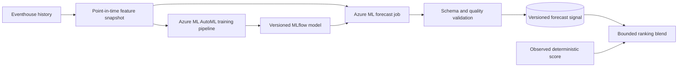

# Azure Machine Learning forecasting research

Research date: 24 September 2026.

## Executive recommendation

Azure Machine Learning AutoML forecasting is a suitable **later experiment**
for predicting near-future product activity, but it should not replace this
POC's deterministic real-time score or be placed on the event-to-rank critical
path.

For this repository:

1. Keep the deterministic, decayed `[0, 100]` trend score as the Phase 1-3
   baseline and degraded-mode fallback.
2. Once enough replayable history exists, train an AutoML forecasting model
   with the current Azure Machine Learning SDK/CLI v2.
3. Start with one pooled model across products so related series can share
   signal. Compare it with naive and deterministic baselines before trying
   Many Models or deep learning.
4. Forecast a future activity target at a fixed horizon, publish it as a
   separate versioned signal, and apply only a bounded contribution to
   ranking.
5. Retrain and score asynchronously. Azure ML job queueing, compute startup,
   inference, and publication latency must be measured; AutoML does not turn
   a Fabric notebook/job route into a seconds-level inference path.

This recommendation reflects the POC's small synthetic catalog, the need for
explainable rank movement, and the absence of historical training data today.

## What Azure ML AutoML forecasting provides

AutoML forecasting searches across model classes and hyperparameters, evaluates
them on time-aware validation splits, and selects the best candidate for a
chosen primary metric. It combines:

- time-series models based mainly on target history;
- regression models that can use calendar, product, behavioral, and other
  explanatory features;
- engineered calendar, lag, and rolling-window features;
- optional ensembles and a temporal convolutional network (TCN);
- pipeline components for training, rolling inference, and metric computation.

It is a model-selection workflow, not one universal "Azure forecasting model."
The best model depends on the target, horizon, number and similarity of series,
available history, future feature availability, compute budget, and evaluation
metric.

### Model families

| Family | AutoML examples | Strengths | Main cautions |
|---|---|---|---|
| Simple baselines | Naive, Seasonal Naive, Average, Seasonal Average | Fast, transparent, and essential as acceptance baselines | Limited capacity |
| Classical time series | ARIMA(X), Exponential Smoothing | Useful for stable per-series level, trend, and seasonality | Training cost grows with the number of series; recursive forecasts can compound error |
| Linear regression | Linear SGD, LARS LASSO, Elastic Net | Fast and relatively interpretable; useful with engineered and known-future features | Can miss nonlinear interactions |
| Tree-based regression | Decision Tree, Random Forest, Extremely Randomized Trees, Gradient Boosted Trees, LightGBM, XGBoost | Captures nonlinear relationships and can learn across products | Requires leakage-safe features and careful explanation |
| Other regression | Prophet, K Nearest Neighbors | Adds different structural assumptions to the model sweep | Prophet trains per series and can be slow across many series |
| Deep learning | `TCNForecaster` | Direct, probabilistic forecasts; can learn complex long-range patterns across series | Optional, slower, GPU recommended, and most useful with at least roughly 1,000 observations; it cannot join forecast ensembles |
| Ensemble | Soft voting over strong candidates | Can improve generalization over one model | More complex to explain; stacked ensembles are disabled by default for forecasting because of observed overfitting risk |

AutoML first selects candidates within time-series model classes, then ranks
those candidates with regression models on validation results, and finally
evaluates a soft-voting ensemble. Selection metrics are calculated on
out-of-sample data.

## Configuration choices

Azure ML documents four broad forecasting configurations:

| Configuration | Appropriate use | Fit for this POC |
|---|---|---|
| Default AutoML | A small number of broadly related series; regression models can learn across them | **Recommended first experiment** for 50-200 products |
| AutoML with TCN | More than roughly 1,000 observations and potentially many series with complex patterns | Defer until a simpler model has a measured accuracy gap and enough history exists |
| Many Models | Large numbers of divergent series requiring separate models and distributed training | Not an initial fit; the POC has little per-product history and would lose cross-product learning |
| Hierarchical time series | Forecasts are required at nested aggregate levels | Consider later for category/colour/product reconciliation, not for the first learned signal |

Restricting the model search with `allowed_training_algorithms` can reduce cost
and improve repeatability. A sensible first comparison is:

- Naive and Seasonal Naive;
- Elastic Net;
- LightGBM or XGBoost;
- Exponential Smoothing;
- the default AutoML soft-voting ensemble.

Do not enable TCN merely because it is more complex. AutoML notes that enabling
DNN training disables best-model explanations for SDK-created experiments, and
the TCN search takes longer.

## Proposed forecasting problem for this repository

### Target

Predict **future weighted product activity** for a fixed window rather than
predicting final search rank directly. For product \(p\) and forecast origin
\(t\), an initial target can be:

```text
futureWeightedActivity(p, t, H) =
    views
  + 2 * addToBag
  + 3 * purchases
```

where the counts occur in `(t, t + H]` and `H` is initially 5 or 15 minutes.
The learned output can then be normalized and confidence-weighted by the same
versioned scoring component used for deterministic signals.

Predicting rank directly would entangle the model with query text, Azure AI
Search relevance, filters, the candidate set, and UI pagination. Keeping the
forecast as a product signal preserves Search as the relevance authority and
allows offline model evaluation independent of serving behavior.

### Training row grain

Use one row per:

```text
(productId, featureWindowEndUtc)
```

with `productId` as the initial time-series ID and
`featureWindowEndUtc` as the time column. Use a regular frequency and retain
the catalog snapshot/version used to build each row.

Candidate features include:

- lagged views, add-to-bag events, purchases, and deterministic scores;
- rolling counts, rates, acceleration, and time since last activity;
- known catalog attributes such as category, colour, brand, and price band;
- calendar features such as minute/hour, day of week, and holidays where
  relevant;
- external trend confidence and matching attributes available at forecast
  origin;
- inventory or promotion values only when their future values are genuinely
  known through the forecast horizon.

AutoML forecasting assumes supplied explanatory features are known into the
future through the horizon. A feature observed only after the forecast origin
must not be copied into future rows. Fit normalization, imputation, and
catalog-derived transformations on training data only.

### Data sufficiency

At minimum, each series needs enough observations for the horizon, maximum lag
or rolling window, and validation folds. Microsoft documents these lower
bounds:

```text
Explicit validation:
H + max(maxLag, rollingWindowSize) + 1

Cross-validation:
2H + (crossValidationFolds - 1) * crossValidationStep
   + max(maxLag, rollingWindowSize) + 1
```

These are technical minima, not evidence that a useful model can be learned.
The synthetic generator should produce multiple baseline cycles, quiet
periods, product spikes, attribute spikes, and recoveries before training.
Short-series padding can create artificial values, so dropped and padded series
must be reported rather than hidden.

## Leakage-safe evaluation

Random train/test splitting is invalid for this use case. Preserve time order
and use:

1. a final chronological holdout covering complete spike and non-spike
   scenarios;
2. rolling-origin cross-validation inside the earlier training period;
3. identical feature-availability rules during training and inference;
4. a gap where needed if an aggregate window could overlap the target period.

Compare every learned model with:

- last-value Naive;
- Seasonal Naive when the generated data has a meaningful season;
- the current deterministic decayed score projected over the same horizon.

Track model metrics by horizon and product/category segment:

- MAE for understandable error magnitude;
- RMSE and normalized RMSE for larger-error sensitivity and AutoML selection;
- spike recall/precision at a predeclared threshold;
- Spearman rank correlation or NDCG over the product signal ordering;
- false-boost rate for products that are relevant candidates but do not spike.

The learned model advances only if it improves the predeclared primary metric
and does not materially regress spike detection, false boosts, or rank
stability. Evaluate several seeded scenario runs; one synthetic trace is not
enough evidence.

## Integration design



The forecast artifact should include at least:

- `productId`;
- `forecastOriginUtc`;
- `horizon`;
- `predictedActivity` and its units;
- model, feature, scoring, and catalog versions;
- training data cutoff;
- calculation and expiry times;
- job/run correlation ID.

Reject incomplete, non-finite, out-of-range, stale, or mismatched-version
outputs. Older forecast origins must not overwrite newer signals. If scoring
fails or a forecast expires, continue with the deterministic path and expose
degraded-mode metadata.

Register and promote the selected model only after holdout evaluation. Use the
official v2 training/inference pipeline pattern and MLflow model output. SDK v1
was deprecated on 31 March 2025 and its support ended on 30 June 2026, so new
work in this repository must not use SDK v1 examples.

## Suggested experiment sequence

1. **Instrument the deterministic baseline.** Persist point-in-time features,
   targets, catalog versions, and scenario labels.
2. **Create a reproducible offline dataset.** Validate regular time spacing,
   duplicate handling, missing intervals, target alignment, and future feature
   availability.
3. **Run a bounded CPU AutoML sweep.** Use SDK/CLI v2, rolling-origin
   validation, explicit time/trial limits, and no TCN.
4. **Evaluate outside AutoML selection.** Score the untouched chronological
   holdout and compare against naive and deterministic baselines.
5. **Shadow publish.** Store forecasts without changing rank; measure
   end-to-end freshness and inspect explanations and errors.
6. **Enable a capped blend behind configuration.** Preserve eligibility,
   relevance, deterministic ties, expiry, and baseline/index-only comparison
   modes.
7. **Consider scale variants only with evidence.** Try TCN, Many Models, or
   hierarchical forecasting only when dataset size, series divergence, or
   aggregate reconciliation justifies the added cost.

## Risks and non-goals

- AutoML is not a substitute for data definition, leakage prevention, or a
  business acceptance metric.
- Synthetic traffic can teach generator artifacts rather than shopper
  behavior. Results demonstrate pipeline mechanics, not production accuracy.
- Missing-row imputation and short-series padding can distort sparse spikes.
- Lag featurization grows the row count roughly with the forecast horizon and
  can cause memory pressure.
- Training and scoring jobs are asynchronous and can miss this POC's freshness
  target. Report measured latency instead of treating submission as success.
- Forecasts must not introduce products outside the Search candidate set or
  override filters and base relevance.
- Online endpoints, TCN/GPU compute, Many Models, and hierarchical forecasting
  are optional experiments, not initial infrastructure requirements.

## Official sources

All sources were accessed on 24 September 2026.

- [Overview of forecasting methods in AutoML](https://learn.microsoft.com/azure/machine-learning/how-to-use-automl-forecasting?view=azureml-api-2)
- [Set up AutoML forecasting with the SDK and CLI](https://learn.microsoft.com/azure/machine-learning/how-to-auto-train-forecast-cli?view=azureml-api-2)
- [Model sweeping and selection for forecasting](https://learn.microsoft.com/azure/machine-learning/concept-automl-forecasting-sweeping?view=azureml-api-2)
- [Lag features for time-series forecasting](https://learn.microsoft.com/azure/machine-learning/concept-automl-forecasting-lags?view=azureml-api-2)
- [Deep learning with AutoML forecasting](https://learn.microsoft.com/azure/machine-learning/concept-automl-forecasting-deep-learning?view=azureml-api-2)
- [Forecasting in AutoML FAQ](https://learn.microsoft.com/azure/machine-learning/how-to-automl-forecasting-faq?view=azureml-api-2)
- [Model interpretability in Azure Machine Learning](https://learn.microsoft.com/azure/machine-learning/how-to-machine-learning-interpretability-automl?view=azureml-api-2)

